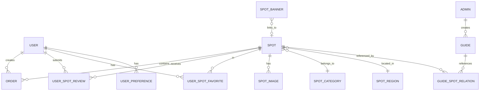

# 数据库设计文档

## 概述

本文档描述旅游推荐系统的数据库设计，包括表结构、索引设计、数据字典和数据库规范。数据库采用 MySQL 8.0，字符集使用 utf8mb4 以支持 emoji 等特殊字符。后端使用 MyBatis-Plus 作为 ORM 框架，全局启用逻辑删除。

## 数据库配置

```yaml
数据库名: waytrip_db
数据库: MySQL 8.0
字符集: utf8mb4
排序规则: utf8mb4_unicode_ci
存储引擎: InnoDB
时区: Asia/Shanghai
```

## 实体关系图



## 表结构设计

### 1. 用户表 (user)

存储微信小程序用户信息。

```sql
CREATE TABLE `user` (
    `id` BIGINT UNSIGNED NOT NULL AUTO_INCREMENT COMMENT '用户ID',
    `openid` VARCHAR(64) NOT NULL COMMENT '微信OpenID',
    `nickname` VARCHAR(64) DEFAULT '' COMMENT '用户昵称',
    `phone` VARCHAR(20) DEFAULT '' COMMENT '手机号',
    `avatar_url` VARCHAR(512) DEFAULT '' COMMENT '头像URL',
    `is_deleted` TINYINT NOT NULL DEFAULT 0 COMMENT '逻辑删除：0-未删除，1-已删除',
    `created_at` DATETIME NOT NULL DEFAULT CURRENT_TIMESTAMP COMMENT '创建时间',
    `updated_at` DATETIME NOT NULL DEFAULT CURRENT_TIMESTAMP ON UPDATE CURRENT_TIMESTAMP COMMENT '更新时间',
    PRIMARY KEY (`id`),
    UNIQUE KEY `uk_openid` (`openid`),
    KEY `idx_created_at` (`created_at`)
) ENGINE=InnoDB DEFAULT CHARSET=utf8mb4 COLLATE=utf8mb4_unicode_ci COMMENT='用户表';
```

| 字段       | 类型            | 约束                | 说明       |
| ---------- | --------------- | ------------------- | ---------- |
| id         | BIGINT UNSIGNED | PK, AUTO_INCREMENT  | 用户ID     |
| openid     | VARCHAR(64)     | UNIQUE, NOT NULL    | 微信OpenID |
| nickname   | VARCHAR(64)     | DEFAULT ''          | 用户昵称   |
| phone      | VARCHAR(20)     | DEFAULT ''          | 手机号     |
| avatar_url | VARCHAR(512)    | DEFAULT ''          | 头像URL    |
| is_deleted | TINYINT         | NOT NULL, DEFAULT 0 | 逻辑删除   |
| created_at | DATETIME        | NOT NULL            | 创建时间   |
| updated_at | DATETIME        | NOT NULL            | 更新时间   |

### 2. 用户偏好标签表 (user_preference)

存储用户选择的偏好标签，用于冷启动推荐。

```sql
CREATE TABLE `user_preference` (
    `id` BIGINT UNSIGNED NOT NULL AUTO_INCREMENT COMMENT '主键ID',
    `user_id` BIGINT UNSIGNED NOT NULL COMMENT '用户ID',
    `tag` VARCHAR(32) NOT NULL COMMENT '偏好标签',
    `is_deleted` TINYINT NOT NULL DEFAULT 0 COMMENT '逻辑删除：0-未删除，1-已删除',
    `created_at` DATETIME NOT NULL DEFAULT CURRENT_TIMESTAMP COMMENT '创建时间',
    PRIMARY KEY (`id`),
    UNIQUE KEY `uk_user_tag` (`user_id`, `tag`),
    KEY `idx_user_id` (`user_id`),
    KEY `idx_user_id_is_deleted` (`user_id`, `is_deleted`)
) ENGINE=InnoDB DEFAULT CHARSET=utf8mb4 COLLATE=utf8mb4_unicode_ci COMMENT='用户偏好标签表';
```

| 字段       | 类型            | 约束                | 说明                               |
| ---------- | --------------- | ------------------- | ---------------------------------- |
| id         | BIGINT UNSIGNED | PK, AUTO_INCREMENT  | 主键ID                             |
| user_id    | BIGINT UNSIGNED | NOT NULL            | 用户ID                             |
| tag        | VARCHAR(32)     | NOT NULL            | 偏好标签（如：自然风光、历史文化） |
| is_deleted | TINYINT         | NOT NULL, DEFAULT 0 | 逻辑删除                           |
| created_at | DATETIME        | NOT NULL            | 创建时间                           |

### 3. 管理员表 (admin)

存储管理后台管理员账号。密码使用 BCrypt 加密存储。

```sql
CREATE TABLE `admin` (
    `id` BIGINT UNSIGNED NOT NULL AUTO_INCREMENT COMMENT '管理员ID',
    `username` VARCHAR(32) NOT NULL COMMENT '用户名',
    `password` VARCHAR(128) NOT NULL COMMENT '密码（BCrypt加密）',
    `real_name` VARCHAR(32) DEFAULT '' COMMENT '真实姓名',
    `is_enabled` TINYINT NOT NULL DEFAULT 1 COMMENT '是否启用：0-禁用，1-启用',
    `is_deleted` TINYINT NOT NULL DEFAULT 0 COMMENT '逻辑删除：0-未删除，1-已删除',
    `last_login_at` DATETIME DEFAULT NULL COMMENT '最后登录时间',
    `created_at` DATETIME NOT NULL DEFAULT CURRENT_TIMESTAMP COMMENT '创建时间',
    `updated_at` DATETIME NOT NULL DEFAULT CURRENT_TIMESTAMP ON UPDATE CURRENT_TIMESTAMP COMMENT '更新时间',
    PRIMARY KEY (`id`),
    UNIQUE KEY `uk_username` (`username`)
) ENGINE=InnoDB DEFAULT CHARSET=utf8mb4 COLLATE=utf8mb4_unicode_ci COMMENT='管理员表';
```

| 字段          | 类型            | 约束                | 说明                     |
| ------------- | --------------- | ------------------- | ------------------------ |
| id            | BIGINT UNSIGNED | PK, AUTO_INCREMENT  | 管理员ID                 |
| username      | VARCHAR(32)     | UNIQUE, NOT NULL    | 用户名                   |
| password      | VARCHAR(128)    | NOT NULL            | 密码（BCrypt加密）       |
| real_name     | VARCHAR(32)     | DEFAULT ''          | 真实姓名                 |
| is_enabled    | TINYINT         | NOT NULL, DEFAULT 1 | 是否启用：0-禁用，1-启用 |
| is_deleted    | TINYINT         | NOT NULL, DEFAULT 0 | 逻辑删除                 |
| last_login_at | DATETIME        | NULL                | 最后登录时间             |
| created_at    | DATETIME        | NOT NULL            | 创建时间                 |
| updated_at    | DATETIME        | NOT NULL            | 更新时间                 |

### 4. 地区表 (spot_region)

存储景点所属地区。

```sql
CREATE TABLE `spot_region` (
    `id` BIGINT UNSIGNED NOT NULL AUTO_INCREMENT COMMENT '地区ID',
    `name` VARCHAR(32) NOT NULL COMMENT '地区名称',
    `sort_order` INT NOT NULL DEFAULT 0 COMMENT '排序序号',
    `is_deleted` TINYINT NOT NULL DEFAULT 0 COMMENT '逻辑删除：0-未删除，1-已删除',
    `created_at` DATETIME NOT NULL DEFAULT CURRENT_TIMESTAMP COMMENT '创建时间',
    PRIMARY KEY (`id`),
    KEY `idx_sort_order` (`sort_order`),
    KEY `idx_is_deleted_sort_order` (`is_deleted`, `sort_order`)
) ENGINE=InnoDB DEFAULT CHARSET=utf8mb4 COLLATE=utf8mb4_unicode_ci COMMENT='景点地区表';
```

| 字段       | 类型            | 约束                | 说明     |
| ---------- | --------------- | ------------------- | -------- |
| id         | BIGINT UNSIGNED | PK, AUTO_INCREMENT  | 地区ID   |
| name       | VARCHAR(32)     | NOT NULL            | 地区名称 |
| sort_order | INT             | NOT NULL, DEFAULT 0 | 排序序号 |
| is_deleted | TINYINT         | NOT NULL, DEFAULT 0 | 逻辑删除 |
| created_at | DATETIME        | NOT NULL            | 创建时间 |

### 5. 景点分类表 (spot_category)

存储景点分类/主题，支持树形层级结构。

```sql
CREATE TABLE `spot_category` (
    `id` BIGINT UNSIGNED NOT NULL AUTO_INCREMENT COMMENT '分类ID',
    `parent_id` BIGINT UNSIGNED DEFAULT 0 COMMENT '父分类ID (0表示顶级分类)',
    `name` VARCHAR(32) NOT NULL COMMENT '分类名称',
    `icon_url` VARCHAR(256) DEFAULT '' COMMENT '分类图标URL',
    `sort_order` INT NOT NULL DEFAULT 0 COMMENT '排序序号',
    `is_deleted` TINYINT NOT NULL DEFAULT 0 COMMENT '逻辑删除：0-未删除，1-已删除',
    `created_at` DATETIME NOT NULL DEFAULT CURRENT_TIMESTAMP COMMENT '创建时间',
    PRIMARY KEY (`id`),
    KEY `idx_sort_order` (`sort_order`),
    KEY `idx_parent_id` (`parent_id`)
) ENGINE=InnoDB DEFAULT CHARSET=utf8mb4 COLLATE=utf8mb4_unicode_ci COMMENT='景点分类表';
```

| 字段       | 类型            | 约束                | 说明                   |
| ---------- | --------------- | ------------------- | ---------------------- |
| id         | BIGINT UNSIGNED | PK, AUTO_INCREMENT  | 分类ID                 |
| parent_id  | BIGINT UNSIGNED | DEFAULT 0           | 父分类ID（0=顶级分类） |
| name       | VARCHAR(32)     | NOT NULL            | 分类名称               |
| icon_url   | VARCHAR(256)    | DEFAULT ''          | 分类图标URL            |
| sort_order | INT             | NOT NULL, DEFAULT 0 | 排序序号               |
| is_deleted | TINYINT         | NOT NULL, DEFAULT 0 | 逻辑删除               |
| created_at | DATETIME        | NOT NULL            | 创建时间               |

### 6. 景点表 (spot)

存储景点核心信息。

```sql
CREATE TABLE `spot` (
    `id` BIGINT UNSIGNED NOT NULL AUTO_INCREMENT COMMENT '景点ID',
    `name` VARCHAR(64) NOT NULL COMMENT '景点名称',
    `description` TEXT COMMENT '景点描述',
    `price` DECIMAL(10,2) NOT NULL DEFAULT 0.00 COMMENT '门票价格',
    `open_time` VARCHAR(128) DEFAULT '' COMMENT '开放时间',
    `address` VARCHAR(256) DEFAULT '' COMMENT '详细地址',
    `latitude` DECIMAL(10,7) DEFAULT NULL COMMENT '纬度',
    `longitude` DECIMAL(10,7) DEFAULT NULL COMMENT '经度',
    `cover_image_url` VARCHAR(512) DEFAULT '' COMMENT '封面图URL',
    `category_id` BIGINT UNSIGNED DEFAULT NULL COMMENT '分类ID',
    `region_id` BIGINT UNSIGNED DEFAULT NULL COMMENT '地区ID',
    `heat_score` INT NOT NULL DEFAULT 0 COMMENT '热度分数',
    `avg_rating` DECIMAL(2,1) NOT NULL DEFAULT 0.0 COMMENT '平均评分',
    `rating_count` INT NOT NULL DEFAULT 0 COMMENT '评分数量',
    `is_published` TINYINT NOT NULL DEFAULT 0 COMMENT '发布状态：0-未发布，1-已发布',
    `is_deleted` TINYINT NOT NULL DEFAULT 0 COMMENT '逻辑删除：0-未删除，1-已删除',
    `created_at` DATETIME NOT NULL DEFAULT CURRENT_TIMESTAMP COMMENT '创建时间',
    `updated_at` DATETIME NOT NULL DEFAULT CURRENT_TIMESTAMP ON UPDATE CURRENT_TIMESTAMP COMMENT '更新时间',
    PRIMARY KEY (`id`),
    KEY `idx_category_id` (`category_id`),
    KEY `idx_region_id` (`region_id`),
    KEY `idx_heat_score` (`heat_score`),
    KEY `idx_is_published` (`is_published`, `is_deleted`)
) ENGINE=InnoDB DEFAULT CHARSET=utf8mb4 COLLATE=utf8mb4_unicode_ci COMMENT='景点表';
```

| 字段            | 类型            | 约束                   | 说明      |
| --------------- | --------------- | ---------------------- | --------- |
| id              | BIGINT UNSIGNED | PK, AUTO_INCREMENT     | 景点ID    |
| name            | VARCHAR(64)     | NOT NULL               | 景点名称  |
| description     | TEXT            | NULL                   | 景点描述  |
| price           | DECIMAL(10,2)   | NOT NULL, DEFAULT 0.00 | 门票价格  |
| open_time       | VARCHAR(128)    | DEFAULT ''             | 开放时间  |
| address         | VARCHAR(256)    | DEFAULT ''             | 详细地址  |
| latitude        | DECIMAL(10,7)   | NULL                   | 纬度      |
| longitude       | DECIMAL(10,7)   | NULL                   | 经度      |
| cover_image_url | VARCHAR(512)    | DEFAULT ''             | 封面图URL |
| category_id     | BIGINT UNSIGNED | NULL                   | 分类ID    |
| region_id       | BIGINT UNSIGNED | NULL                   | 地区ID    |
| heat_score      | INT             | NOT NULL, DEFAULT 0    | 热度分数  |
| avg_rating      | DECIMAL(2,1)    | NOT NULL, DEFAULT 0.0  | 平均评分  |
| rating_count    | INT             | NOT NULL, DEFAULT 0    | 评分数量  |
| is_published    | TINYINT         | NOT NULL, DEFAULT 0    | 发布状态  |
| is_deleted      | TINYINT         | NOT NULL, DEFAULT 0    | 逻辑删除  |
| created_at      | DATETIME        | NOT NULL               | 创建时间  |
| updated_at      | DATETIME        | NOT NULL               | 更新时间  |

### 7. 景点图片表 (spot_image)

存储景点的多张图片。

```sql
CREATE TABLE `spot_image` (
    `id` BIGINT UNSIGNED NOT NULL AUTO_INCREMENT COMMENT '图片ID',
    `spot_id` BIGINT UNSIGNED NOT NULL COMMENT '景点ID',
    `image_url` VARCHAR(512) NOT NULL COMMENT '图片URL',
    `sort_order` INT NOT NULL DEFAULT 0 COMMENT '排序序号',
    `is_deleted` TINYINT NOT NULL DEFAULT 0 COMMENT '逻辑删除：0-未删除，1-已删除',
    `created_at` DATETIME NOT NULL DEFAULT CURRENT_TIMESTAMP COMMENT '创建时间',
    `updated_at` DATETIME NOT NULL DEFAULT CURRENT_TIMESTAMP ON UPDATE CURRENT_TIMESTAMP COMMENT '更新时间',
    PRIMARY KEY (`id`),
    KEY `idx_spot_id` (`spot_id`),
    KEY `idx_spot_id_is_deleted_sort` (`spot_id`, `is_deleted`, `sort_order`)
) ENGINE=InnoDB DEFAULT CHARSET=utf8mb4 COLLATE=utf8mb4_unicode_ci COMMENT='景点图片表';
```

| 字段       | 类型            | 约束                | 说明     |
| ---------- | --------------- | ------------------- | -------- |
| id         | BIGINT UNSIGNED | PK, AUTO_INCREMENT  | 图片ID   |
| spot_id    | BIGINT UNSIGNED | NOT NULL            | 景点ID   |
| image_url  | VARCHAR(512)    | NOT NULL            | 图片URL  |
| sort_order | INT             | NOT NULL, DEFAULT 0 | 排序序号 |
| is_deleted | TINYINT         | NOT NULL, DEFAULT 0 | 逻辑删除 |
| created_at | DATETIME        | NOT NULL            | 创建时间 |
| updated_at | DATETIME        | NOT NULL            | 更新时间 |

### 8. 攻略表 (guide)

存储旅游攻略内容。

```sql
CREATE TABLE `guide` (
    `id` BIGINT UNSIGNED NOT NULL AUTO_INCREMENT COMMENT '攻略ID',
    `title` VARCHAR(128) NOT NULL COMMENT '攻略标题',
    `content` MEDIUMTEXT COMMENT '攻略内容（富文本，支持长文）',
    `cover_image_url` VARCHAR(512) DEFAULT '' COMMENT '封面图URL',
    `category` VARCHAR(32) DEFAULT '' COMMENT '攻略分类',
    `admin_id` BIGINT UNSIGNED DEFAULT NULL COMMENT '创建管理员ID',
    `view_count` INT NOT NULL DEFAULT 0 COMMENT '浏览次数',
    `is_published` TINYINT NOT NULL DEFAULT 0 COMMENT '发布状态：0-未发布，1-已发布',
    `is_deleted` TINYINT NOT NULL DEFAULT 0 COMMENT '逻辑删除：0-未删除，1-已删除',
    `created_at` DATETIME NOT NULL DEFAULT CURRENT_TIMESTAMP COMMENT '创建时间',
    `updated_at` DATETIME NOT NULL DEFAULT CURRENT_TIMESTAMP ON UPDATE CURRENT_TIMESTAMP COMMENT '更新时间',
    PRIMARY KEY (`id`),
    KEY `idx_category` (`category`),
    KEY `idx_view_count` (`view_count`),
    KEY `idx_is_published` (`is_published`, `is_deleted`)
) ENGINE=InnoDB DEFAULT CHARSET=utf8mb4 COLLATE=utf8mb4_unicode_ci COMMENT='攻略表';
```

| 字段            | 类型            | 约束                | 说明                   |
| --------------- | --------------- | ------------------- | ---------------------- |
| id              | BIGINT UNSIGNED | PK, AUTO_INCREMENT  | 攻略ID                 |
| title           | VARCHAR(128)    | NOT NULL            | 攻略标题               |
| content         | MEDIUMTEXT      | NULL                | 攻略内容（富文本HTML） |
| cover_image_url | VARCHAR(512)    | DEFAULT ''          | 封面图URL              |
| category        | VARCHAR(32)     | DEFAULT ''          | 攻略分类               |
| admin_id        | BIGINT UNSIGNED | NULL                | 创建管理员ID           |
| view_count      | INT             | NOT NULL, DEFAULT 0 | 浏览次数               |
| is_published    | TINYINT         | NOT NULL, DEFAULT 0 | 发布状态               |
| is_deleted      | TINYINT         | NOT NULL, DEFAULT 0 | 逻辑删除               |
| created_at      | DATETIME        | NOT NULL            | 创建时间               |
| updated_at      | DATETIME        | NOT NULL            | 更新时间               |

### 9. 攻略关联景点表 (guide_spot_relation)

存储攻略与景点的关联关系。

```sql
CREATE TABLE `guide_spot_relation` (
    `id` BIGINT UNSIGNED NOT NULL AUTO_INCREMENT COMMENT '主键ID',
    `guide_id` BIGINT UNSIGNED NOT NULL COMMENT '攻略ID',
    `spot_id` BIGINT UNSIGNED NOT NULL COMMENT '景点ID',
    `sort_order` INT NOT NULL DEFAULT 0 COMMENT '排序序号',
    `is_deleted` TINYINT NOT NULL DEFAULT 0 COMMENT '逻辑删除：0-未删除，1-已删除',
    `created_at` DATETIME NOT NULL DEFAULT CURRENT_TIMESTAMP COMMENT '创建时间',
    PRIMARY KEY (`id`),
    UNIQUE KEY `uk_guide_spot` (`guide_id`, `spot_id`),
    KEY `idx_guide_id` (`guide_id`),
    KEY `idx_spot_id` (`spot_id`),
    KEY `idx_guide_id_is_deleted_sort` (`guide_id`, `is_deleted`, `sort_order`),
    KEY `idx_spot_id_is_deleted` (`spot_id`, `is_deleted`)
) ENGINE=InnoDB DEFAULT CHARSET=utf8mb4 COLLATE=utf8mb4_unicode_ci COMMENT='攻略景点关联表';
```

| 字段       | 类型            | 约束                | 说明     |
| ---------- | --------------- | ------------------- | -------- |
| id         | BIGINT UNSIGNED | PK, AUTO_INCREMENT  | 主键ID   |
| guide_id   | BIGINT UNSIGNED | NOT NULL            | 攻略ID   |
| spot_id    | BIGINT UNSIGNED | NOT NULL            | 景点ID   |
| sort_order | INT             | NOT NULL, DEFAULT 0 | 排序序号 |
| is_deleted | TINYINT         | NOT NULL, DEFAULT 0 | 逻辑删除 |
| created_at | DATETIME        | NOT NULL            | 创建时间 |

### 10. 订单表 (order)

存储用户订单信息。

```sql
CREATE TABLE `order` (
    `id` BIGINT UNSIGNED NOT NULL AUTO_INCREMENT COMMENT '订单ID',
    `order_no` VARCHAR(32) NOT NULL COMMENT '订单编号',
    `user_id` BIGINT UNSIGNED NOT NULL COMMENT '用户ID',
    `spot_id` BIGINT UNSIGNED NOT NULL COMMENT '景点ID',
    `quantity` INT NOT NULL DEFAULT 1 COMMENT '购买数量',
    `total_amount` DECIMAL(10,2) NOT NULL COMMENT '订单总金额',
    `status` TINYINT NOT NULL DEFAULT 0 COMMENT '订单状态：0-待支付，1-已支付，2-已取消，3-已退款，4-已完成',
    `visit_date` DATE NOT NULL COMMENT '游玩日期',
    `contact_name` VARCHAR(32) DEFAULT '' COMMENT '联系人姓名',
    `contact_phone` VARCHAR(20) DEFAULT '' COMMENT '联系人电话',
    `paid_at` DATETIME DEFAULT NULL COMMENT '支付时间',
    `cancelled_at` DATETIME DEFAULT NULL COMMENT '取消时间',
    `refunded_at` DATETIME DEFAULT NULL COMMENT '退款时间',
    `completed_at` DATETIME DEFAULT NULL COMMENT '完成时间',
    `is_deleted` TINYINT NOT NULL DEFAULT 0 COMMENT '逻辑删除：0-未删除，1-已删除',
    `created_at` DATETIME NOT NULL DEFAULT CURRENT_TIMESTAMP COMMENT '创建时间',
    `updated_at` DATETIME NOT NULL DEFAULT CURRENT_TIMESTAMP ON UPDATE CURRENT_TIMESTAMP COMMENT '更新时间',
    PRIMARY KEY (`id`),
    UNIQUE KEY `uk_order_no` (`order_no`),
    KEY `idx_spot_id` (`spot_id`),
    KEY `idx_status` (`status`),
    KEY `idx_created_at` (`created_at`),
    KEY `idx_user_id_status` (`user_id`, `is_deleted`, `created_at`)
) ENGINE=InnoDB DEFAULT CHARSET=utf8mb4 COLLATE=utf8mb4_unicode_ci COMMENT='订单表';
```

| 字段          | 类型            | 约束                | 说明       |
| ------------- | --------------- | ------------------- | ---------- |
| id            | BIGINT UNSIGNED | PK, AUTO_INCREMENT  | 订单ID     |
| order_no      | VARCHAR(32)     | UNIQUE, NOT NULL    | 订单编号   |
| user_id       | BIGINT UNSIGNED | NOT NULL            | 用户ID     |
| spot_id       | BIGINT UNSIGNED | NOT NULL            | 景点ID     |
| quantity      | INT             | NOT NULL, DEFAULT 1 | 购买数量   |
| total_amount  | DECIMAL(10,2)   | NOT NULL            | 订单总金额 |
| status        | TINYINT         | NOT NULL, DEFAULT 0 | 订单状态   |
| visit_date    | DATE            | NOT NULL            | 游玩日期   |
| contact_name  | VARCHAR(32)     | DEFAULT ''          | 联系人姓名 |
| contact_phone | VARCHAR(20)     | DEFAULT ''          | 联系人电话 |
| paid_at       | DATETIME        | NULL                | 支付时间   |
| cancelled_at  | DATETIME        | NULL                | 取消时间   |
| refunded_at   | DATETIME        | NULL                | 退款时间   |
| completed_at  | DATETIME        | NULL                | 完成时间   |
| is_deleted    | TINYINT         | NOT NULL, DEFAULT 0 | 逻辑删除   |
| created_at    | DATETIME        | NOT NULL            | 创建时间   |
| updated_at    | DATETIME        | NOT NULL            | 更新时间   |

**订单状态枚举值：**

- `0` - 待支付 (PENDING_PAYMENT)
- `1` - 已支付 (PAID)
- `2` - 已取消 (CANCELLED)
- `3` - 已退款 (REFUNDED)
- `4` - 已完成 (COMPLETED)

### 11. 评价表 (user_spot_review)

存储用户对景点的评分和评论。

```sql
CREATE TABLE `user_spot_review` (
    `id` BIGINT UNSIGNED NOT NULL AUTO_INCREMENT COMMENT '评分ID',
    `user_id` BIGINT UNSIGNED NOT NULL COMMENT '用户ID',
    `spot_id` BIGINT UNSIGNED NOT NULL COMMENT '景点ID',
    `score` TINYINT NOT NULL COMMENT '评分（1-5）',
    `comment` TEXT COMMENT '评论',
    `is_deleted` TINYINT NOT NULL DEFAULT 0 COMMENT '逻辑删除：0-未删除，1-已删除',
    `created_at` DATETIME NOT NULL DEFAULT CURRENT_TIMESTAMP COMMENT '创建时间',
    `updated_at` DATETIME NOT NULL DEFAULT CURRENT_TIMESTAMP ON UPDATE CURRENT_TIMESTAMP COMMENT '更新时间',
    PRIMARY KEY (`id`),
    UNIQUE KEY `uk_user_spot` (`user_id`, `spot_id`),
    KEY `idx_created_at` (`created_at`),
    KEY `idx_spot_list` (`spot_id`, `is_deleted`, `created_at`)
) ENGINE=InnoDB DEFAULT CHARSET=utf8mb4 COLLATE=utf8mb4_unicode_ci COMMENT='评价表';
```

| 字段       | 类型            | 约束                | 说明        |
| ---------- | --------------- | ------------------- | ----------- |
| id         | BIGINT UNSIGNED | PK, AUTO_INCREMENT  | 评分ID      |
| user_id    | BIGINT UNSIGNED | NOT NULL            | 用户ID      |
| spot_id    | BIGINT UNSIGNED | NOT NULL            | 景点ID      |
| score      | TINYINT         | NOT NULL            | 评分（1-5） |
| comment    | TEXT            | NULL                | 评论内容    |
| is_deleted | TINYINT         | NOT NULL, DEFAULT 0 | 逻辑删除    |
| created_at | DATETIME        | NOT NULL            | 创建时间    |
| updated_at | DATETIME        | NOT NULL            | 更新时间    |

### 12. 收藏表 (user_spot_favorite)

存储用户收藏的景点。

```sql
CREATE TABLE `user_spot_favorite` (
    `id` BIGINT UNSIGNED NOT NULL AUTO_INCREMENT COMMENT '收藏ID',
    `user_id` BIGINT UNSIGNED NOT NULL COMMENT '用户ID',
    `spot_id` BIGINT UNSIGNED NOT NULL COMMENT '景点ID',
    `is_deleted` TINYINT NOT NULL DEFAULT 0 COMMENT '逻辑删除：0-未删除，1-已删除',
    `created_at` DATETIME NOT NULL DEFAULT CURRENT_TIMESTAMP COMMENT '创建时间',
    PRIMARY KEY (`id`),
    UNIQUE KEY `uk_user_spot` (`user_id`, `spot_id`),
    KEY `idx_user_id` (`user_id`),
    KEY `idx_spot_id` (`spot_id`),
    KEY `idx_user_id_is_deleted_created_at` (`user_id`, `is_deleted`, `created_at`),
    KEY `idx_spot_id_is_deleted` (`spot_id`, `is_deleted`)
) ENGINE=InnoDB DEFAULT CHARSET=utf8mb4 COLLATE=utf8mb4_unicode_ci COMMENT='收藏表';
```

| 字段       | 类型            | 约束                | 说明     |
| ---------- | --------------- | ------------------- | -------- |
| id         | BIGINT UNSIGNED | PK, AUTO_INCREMENT  | 收藏ID   |
| user_id    | BIGINT UNSIGNED | NOT NULL            | 用户ID   |
| spot_id    | BIGINT UNSIGNED | NOT NULL            | 景点ID   |
| is_deleted | TINYINT         | NOT NULL, DEFAULT 0 | 逻辑删除 |
| created_at | DATETIME        | NOT NULL            | 创建时间 |

### 13. 轮播图表 (spot_banner)

存储首页轮播图配置。

```sql
CREATE TABLE `spot_banner` (
    `id` BIGINT UNSIGNED NOT NULL AUTO_INCREMENT COMMENT '轮播图ID',
    `image_url` VARCHAR(512) NOT NULL COMMENT '图片URL',
    `spot_id` BIGINT UNSIGNED DEFAULT NULL COMMENT '关联景点ID',
    `sort_order` INT NOT NULL DEFAULT 0 COMMENT '排序序号',
    `is_enabled` TINYINT NOT NULL DEFAULT 1 COMMENT '是否启用：0-禁用，1-启用',
    `is_deleted` TINYINT NOT NULL DEFAULT 0 COMMENT '逻辑删除：0-未删除，1-已删除',
    `created_at` DATETIME NOT NULL DEFAULT CURRENT_TIMESTAMP COMMENT '创建时间',
    `updated_at` DATETIME NOT NULL DEFAULT CURRENT_TIMESTAMP ON UPDATE CURRENT_TIMESTAMP COMMENT '更新时间',
    PRIMARY KEY (`id`),
    KEY `idx_is_enabled_sort` (`is_enabled`, `is_deleted`, `sort_order`),
    KEY `idx_spot_id_is_deleted` (`spot_id`, `is_deleted`)
) ENGINE=InnoDB DEFAULT CHARSET=utf8mb4 COLLATE=utf8mb4_unicode_ci COMMENT='景点轮播图表';
```

| 字段       | 类型            | 约束                | 说明       |
| ---------- | --------------- | ------------------- | ---------- |
| id         | BIGINT UNSIGNED | PK, AUTO_INCREMENT  | 轮播图ID   |
| image_url  | VARCHAR(512)    | NOT NULL            | 图片URL    |
| spot_id    | BIGINT UNSIGNED | NULL                | 关联景点ID |
| sort_order | INT             | NOT NULL, DEFAULT 0 | 排序序号   |
| is_enabled | TINYINT         | NOT NULL, DEFAULT 1 | 是否启用   |
| is_deleted | TINYINT         | NOT NULL, DEFAULT 0 | 逻辑删除   |
| created_at | DATETIME        | NOT NULL            | 创建时间   |
| updated_at | DATETIME        | NOT NULL            | 更新时间   |

## 索引设计说明

### 索引策略

| 表名                | 索引名                            | 索引类型 | 字段                               | 用途                    |
| ------------------- | --------------------------------- | -------- | ---------------------------------- | ----------------------- |
| user                | uk_openid                         | UNIQUE   | openid                             | 微信登录查询            |
| user                | idx_created_at                    | BTREE    | created_at                         | 按注册时间查询          |
| spot                | idx_is_published                  | BTREE    | is_published, is_deleted           | 发布状态+软删除联合过滤 |
| spot                | idx_heat_score                    | BTREE    | heat_score                         | 热门排序                |
| spot                | idx_category_id                   | BTREE    | category_id                        | 分类筛选                |
| spot                | idx_region_id                     | BTREE    | region_id                          | 地区筛选                |
| spot_category       | idx_parent_id                     | BTREE    | parent_id                          | 子分类查询              |
| order               | uk_order_no                       | UNIQUE   | order_no                           | 订单号查询              |
| order               | idx_user_id_status                | BTREE    | user_id, is_deleted, created_at    | 用户订单列表            |
| order               | idx_created_at                    | BTREE    | created_at                         | 按创建时间排序          |
| user_spot_review    | uk_user_spot                      | UNIQUE   | user_id, spot_id                   | 防止重复评分            |
| user_spot_review    | idx_spot_list                     | BTREE    | spot_id, is_deleted, created_at    | 景点评论列表            |
| user_spot_favorite  | uk_user_spot                      | UNIQUE   | user_id, spot_id                   | 防止重复收藏            |
| user_spot_favorite  | idx_user_id_is_deleted_created_at | BTREE    | user_id, is_deleted, created_at    | 收藏列表查询            |
| guide               | idx_is_published                  | BTREE    | is_published, is_deleted           | 发布状态+软删除联合过滤 |
| guide_spot_relation | uk_guide_spot                     | UNIQUE   | guide_id, spot_id                  | 防止重复关联            |
| guide_spot_relation | idx_guide_id_is_deleted_sort      | BTREE    | guide_id, is_deleted, sort_order   | 攻略关联景点查询        |
| spot_banner         | idx_is_enabled_sort               | BTREE    | is_enabled, is_deleted, sort_order | 启用轮播图排序查询      |

## Redis 缓存设计

### 缓存 Key 设计

| Key 格式                   | 数据类型 | 过期时间 | 说明             |
| -------------------------- | -------- | -------- | ---------------- |
| `user:token:{token}`       | String   | 7天      | 用户登录Token    |
| `admin:token:{token}`      | String   | 24小时   | 管理员登录Token  |
| `spot:detail:{spotId}`     | Hash     | 1小时    | 景点详情缓存     |
| `spot:hot:list`            | ZSet     | 10分钟   | 热门景点列表     |
| `item:similarity:{spotId}` | Hash     | 24小时   | 物品相似度矩阵   |
| `user:rec:{userId}`        | List     | 30分钟   | 用户推荐结果缓存 |
| `banner:list`              | List     | 5分钟    | 轮播图列表       |

## 数据库规范

### 命名规范

1. **表名**：小写下划线命名，使用业务域前缀（如 `spot_category`、`user_spot_favorite`）
2. **字段名**：小写下划线命名，如 `created_at`、`cover_image_url`
3. **布尔型字段**：统一使用 `is_` 前缀，如 `is_deleted`、`is_published`、`is_enabled`
4. **索引名**：
   - 主键：`PRIMARY`
   - 唯一索引：`uk_` 前缀
   - 普通索引：`idx_` 前缀
   - 联合索引：按字段顺序命名，如 `idx_user_id_is_deleted_created_at`

### 字段规范

1. **主键**：统一使用 `BIGINT UNSIGNED AUTO_INCREMENT`
2. **时间字段**：统一使用 `DATETIME` 类型
3. **金额字段**：统一使用 `DECIMAL(10,2)`
4. **状态字段**：使用 `TINYINT`
5. **URL 字段**：使用 `VARCHAR(512)`
6. **长文本**：一般使用 `TEXT`，攻略内容使用 `MEDIUMTEXT` 以支持长文
7. **逻辑删除**：所有表统一包含 `is_deleted` 字段，使用 MyBatis-Plus 全局逻辑删除配置

### 外键约束

本设计不使用数据库外键约束，通过应用层保证数据一致性，原因：

1. 提高写入性能
2. 便于分库分表扩展
3. 简化数据迁移
