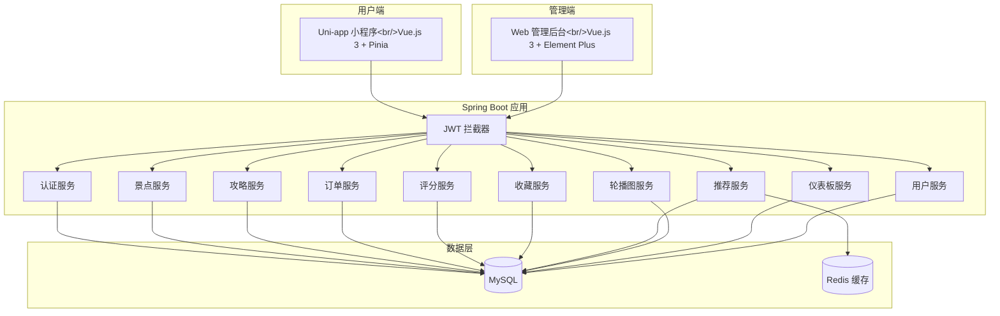
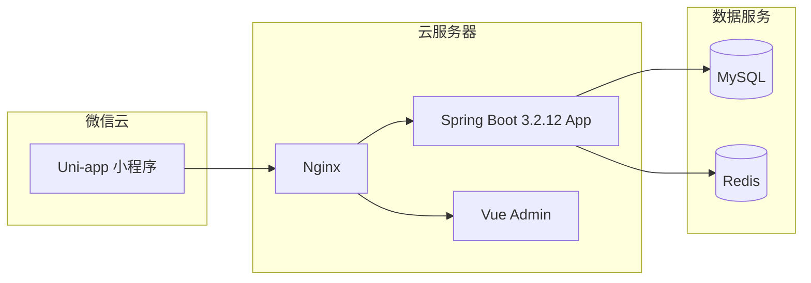
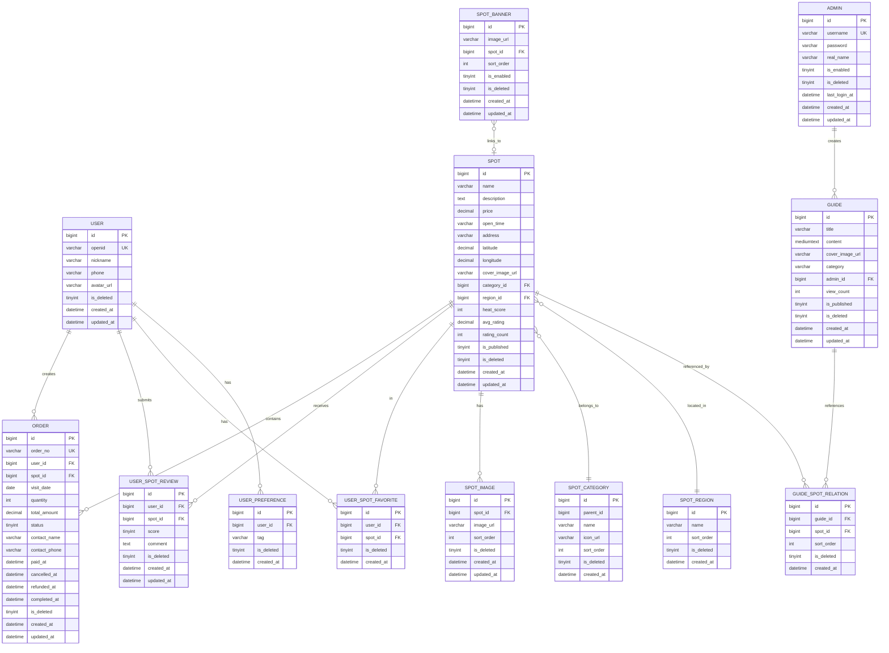
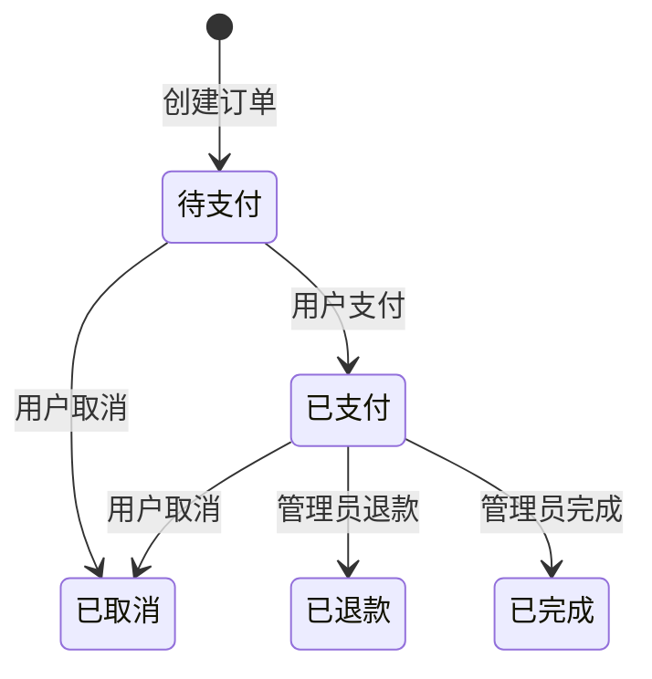
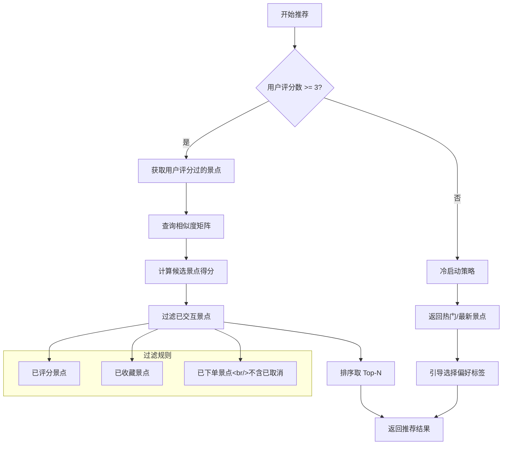
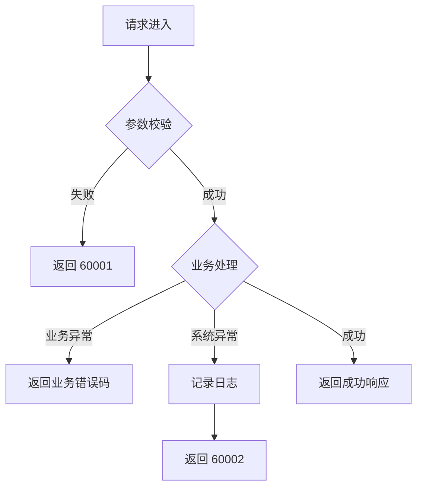

# 设计文档

## 概述

本设计文档描述了基于协同过滤推荐算法的个性化旅游推荐系统的技术架构和实现方案。系统采用前后端分离架构，包含基于 Uni-app 的跨端小程序（用户端）和 Web 管理后台（管理端），后端使用 Java 17 + Spring Boot 3.2.12 + MyBatis-Plus 构建 RESTful API，数据库使用 MySQL 8.0，推荐算法采用 ItemCF（基于物品的协同过滤）。

## 架构

### 整体架构图



### 技术栈

| 层级     | 技术选型                                          |
| -------- | ------------------------------------------------- |
| 用户端   | Uni-app + Vue.js 3 + Pinia                        |
| 管理端   | Vue.js 3 + Element Plus + Axios                   |
| 后端     | Java 17 + Spring Boot 3.2.12 + MyBatis-Plus 3.5.5 |
| 数据库   | MySQL 8.0                                         |
| 缓存     | Redis                                             |
| 认证     | JWT Token                                         |
| API 文档 | Knife4j 4.5.0 (OpenAPI 3)                         |

### 部署架构



## 组件和接口

### 1. 认证服务 (AuthService)

负责用户登录、注册和身份验证。

```java
public interface AuthService {
    /** 微信小程序登录 */
    LoginResponse wxLogin(String code);

    /** 获取用户信息 */
    UserInfoResponse getUserInfo(Long userId);

    /** 更新用户信息 */
    void updateUserInfo(Long userId, UpdateUserInfoRequest request);

    /** 设置用户偏好标签 */
    void setPreferences(Long userId, List<String> tags);

    /** 管理员登录 */
    AdminLoginResponse adminLogin(AdminLoginRequest request);

    /** 获取管理员信息 */
    AdminLoginResponse.AdminInfo getAdminInfo(Long adminId);
}
```

### 2. 景点服务 (SpotService)

管理景点数据的增删改查。

```java
public interface SpotService {
    /** 获取景点列表（用户端） */
    PageResult<SpotListResponse> getSpotList(SpotListRequest request);

    /** 搜索景点 */
    PageResult<SpotListResponse> searchSpots(String keyword, Integer page, Integer pageSize);

    /** 获取景点详情 */
    SpotDetailResponse getSpotDetail(Long spotId, Long userId);

    /** 获取筛选选项（分类+地区） */
    SpotFilterResponse getFilters();

    /** 获取景点列表（管理端） */
    PageResult<AdminSpotListResponse> getAdminSpotList(AdminSpotListRequest request);

    /** 获取景点详情（管理端） */
    AdminSpotRequest getAdminSpotDetail(Long spotId);

    /** 创建景点 */
    Long createSpot(AdminSpotRequest request);

    /** 更新景点 */
    void updateSpot(Long spotId, AdminSpotRequest request);

    /** 更新发布状态 */
    void updatePublishStatus(Long spotId, Boolean published);

    /** 删除景点（逻辑删除） */
    void deleteSpot(Long spotId);
}
```

### 3. 推荐服务 (RecommendationService)

基于 ItemCF 算法的个性化推荐。

```java
public interface RecommendationService {
    /** 获取个性化推荐 */
    RecommendationResponse getRecommendations(Long userId, Integer limit);

    /** 刷新推荐（重新计算） */
    RecommendationResponse refreshRecommendations(Long userId, Integer limit);

    /** 获取热门景点 */
    HotSpotResponse getHotSpots(Integer limit);

    /** 计算并更新物品相似度矩阵 */
    void updateSimilarityMatrix();
}
```

### 4. 攻略服务 (GuideService)

管理旅游攻略内容。

```java
public interface GuideService {
    /** 获取攻略列表（用户端） */
    PageResult<GuideListResponse> getGuideList(GuideListRequest request);

    /** 获取攻略详情 */
    GuideDetailResponse getGuideDetail(Long guideId);

    /** 获取攻略分类列表 */
    List<String> getCategories();

    /** 获取攻略列表（管理端） */
    PageResult<AdminGuideListResponse> getAdminGuideList(AdminGuideListRequest request);

    /** 获取攻略详情（管理端） */
    AdminGuideRequest getAdminGuideDetail(Long guideId);

    /** 创建攻略 */
    Long createGuide(AdminGuideRequest request, Long adminId);

    /** 更新攻略 */
    void updateGuide(Long guideId, AdminGuideRequest request);

    /** 更新发布状态 */
    void updatePublishStatus(Long guideId, Boolean published);

    /** 删除攻略（逻辑删除） */
    void deleteGuide(Long guideId);
}
```

### 5. 订单服务 (OrderService)

处理订单创建、支付、取消、退款等流程。

```java
public interface OrderService {
    /** 创建订单 */
    OrderDetailResponse createOrder(Long userId, CreateOrderRequest request);

    /** 获取用户订单列表 */
    OrderListResponse getUserOrders(Long userId, OrderListRequest request);

    /** 获取订单详情 */
    OrderDetailResponse getOrderDetail(Long userId, Long orderId);

    /** 模拟支付 */
    OrderDetailResponse payOrder(Long userId, Long orderId, String idempotentKey);

    /** 取消订单 */
    OrderDetailResponse cancelOrder(Long userId, Long orderId);

    /** 管理端获取订单列表 */
    AdminOrderListResponse getAdminOrders(AdminOrderListRequest request);

    /** 管理端获取订单详情 */
    OrderDetailResponse getAdminOrderDetail(Long orderId);

    /** 管理端完成订单 */
    OrderDetailResponse completeOrder(Long orderId);

    /** 管理端退款订单 */
    OrderDetailResponse refundOrder(Long orderId);
}
```

### 6. 评分服务 (RatingService)

处理用户对景点的评分与评论。

```java
public interface RatingService {
    /** 提交评分 */
    void submitRating(Long userId, RatingRequest request);

    /** 获取用户对景点的评分 */
    RatingResponse getUserRating(Long userId, Long spotId);

    /** 获取景点评论列表 */
    PageResult<RatingResponse> getSpotRatings(Long spotId, Integer page, Integer pageSize);

    /** 获取用户评分数量 */
    int getUserRatingCount(Long userId);
}
```

### 7. 收藏服务 (FavoriteService)

管理用户收藏列表。

```java
public interface FavoriteService {
    /** 添加收藏 */
    void addFavorite(Long userId, Long spotId);

    /** 取消收藏 */
    void removeFavorite(Long userId, Long spotId);

    /** 检查是否已收藏 */
    boolean isFavorite(Long userId, Long spotId);

    /** 获取收藏列表 */
    PageResult<SpotListResponse> getFavoriteList(Long userId, Integer page, Integer pageSize);
}
```

### 8. 轮播图服务 (BannerService)

管理首页轮播图配置。

```java
public interface BannerService {
    /** 获取轮播图列表（用户端） */
    BannerResponse getBanners();

    /** 获取轮播图列表（管理端） */
    AdminBannerListResponse getAdminBanners();

    /** 创建轮播图 */
    void createBanner(AdminBannerRequest request);

    /** 更新轮播图 */
    void updateBanner(Long id, AdminBannerRequest request);

    /** 删除轮播图 */
    void deleteBanner(Long id);

    /** 切换启用状态 */
    void toggleEnabled(Long id);
}
```

### 9. 仪表板服务 (DashboardService)

提供管理后台统计数据。

```java
public interface DashboardService {
    /** 获取概览数据 */
    DashboardOverviewResponse getOverview();

    /** 获取订单趋势 */
    OrderTrendResponse getOrderTrend(Integer days);

    /** 获取热门景点 */
    HotSpotsResponse getHotSpots(Integer limit);
}
```

### 10. 用户服务 (UserService)

管理端用户信息查看。

```java
public interface UserService {
    /** 获取用户列表（管理端） */
    AdminUserListResponse getAdminUsers(AdminUserListRequest request);

    /** 获取用户详情（管理端） */
    AdminUserDetailResponse getAdminUserDetail(Long userId);
}
```

## 数据模型

### 实体关系图



### 核心数据结构

#### 订单状态

订单使用整数常量表示状态：

```java
// Order.java 中的状态常量
public static final int STATUS_PENDING = 0;    // 待支付
public static final int STATUS_PAID = 1;       // 已支付
public static final int STATUS_CANCELLED = 2;  // 已取消
public static final int STATUS_REFUNDED = 3;   // 已退款
public static final int STATUS_COMPLETED = 4;  // 已完成
```

#### 订单状态转换



#### 物品相似度矩阵（ItemCF）

```java
/**
 * 物品相似度矩阵存储结构
 * 使用 Redis Hash 存储，key 格式: item_similarity:{spotId}
 * field: 相似景点ID, value: 相似度分数
 */
public class ItemSimilarityMatrix {
    private Map<Long, Map<Long, Double>> similarityMatrix;

    /**
     * 获取与指定景点最相似的 Top-K 景点
     * @param spotId 景点ID
     * @param k 数量
     * @return 相似景点及其相似度
     */
    public List<SimilarItem> getTopKSimilar(Long spotId, int k);
}

public class SimilarItem {
    private Long spotId;
    private Double similarity;
}
```

### ItemCF 推荐算法流程



### 推荐得分计算公式

对于用户 u，候选景点 j 的推荐得分计算如下：

```
Score(u, j) = Σ (sim(i, j) × rating(u, i)) / Σ sim(i, j)

其中：
- i 为用户 u 评分过的景点
- sim(i, j) 为景点 i 和 j 的相似度
- rating(u, i) 为用户 u 对景点 i 的评分
```

### 物品相似度计算（余弦相似度）

```
sim(i, j) = |U(i) ∩ U(j)| / sqrt(|U(i)| × |U(j)|)

其中：
- U(i) 为评分过景点 i 的用户集合
- U(j) 为评分过景点 j 的用户集合
```

## 正确性属性

_正确性属性是系统在所有有效执行中都应保持为真的特征或行为——本质上是关于系统应该做什么的形式化陈述。属性作为人类可读规范和机器可验证正确性保证之间的桥梁。_

### Property 1: 登录幂等性

_对于任意_ OpenID，无论登录多少次，系统应返回相同的用户记录，不创建重复用户。

**验证: 需求 1.2, 1.3**

### Property 2: 用户信息更新往返

_对于任意_ 用户和任意有效昵称，更新昵称后立即查询应返回更新后的值。

**验证: 需求 1.5**

### Property 3: 热门推荐排序

_对于任意_ 热门推荐列表，列表中的景点应按热度分数降序排列。

**验证: 需求 2.3**

### Property 4: 推荐过滤规则

_对于任意_ 有足够交互记录的用户，推荐结果不应包含该用户已评分、已收藏或已下单（不含已取消订单）的景点。

**验证: 需求 3.3, 3.4**

### Property 5: 冷启动策略

_对于任意_ 评分数量少于3的用户，推荐引擎应返回热门景点列表而非个性化推荐。

**验证: 需求 3.2**

### Property 6: 个性化推荐差异性

_对于任意_ 有足够交互记录的用户，其个性化推荐列表应与全局热门列表存在差异（至少有一个不同的景点）。

**验证: 需求 3.6**

### Property 7: 景点筛选正确性

_对于任意_ 景点列表查询，当指定地区或类型筛选条件时，返回的所有景点应满足该筛选条件。

**验证: 需求 4.1**

### Property 8: 景点排序正确性

_对于任意_ 景点列表查询，当指定排序方式（热度/评分/价格）时，返回的景点应按该字段正确排序。

**验证: 需求 4.2**

### Property 9: 搜索结果相关性

_对于任意_ 搜索关键词，返回的所有景点名称应包含该关键词（模糊匹配）。

**验证: 需求 4.4**

### Property 10: 景点详情完整性

_对于任意_ 景点详情查询，返回的数据应包含图片、简介、票价、开放时间、地址和经纬度。

**验证: 需求 4.6**

### Property 11: 攻略排序正确性

_对于任意_ 攻略列表查询，当指定排序方式时，返回的攻略应按该方式正确排序。

**验证: 需求 5.1**

### Property 12: 发布状态过滤

_对于任意_ 用户端的景点或攻略列表查询，返回的所有项目应为已发布状态（is_published=1）。

**验证: 需求 5.4, 14.3, 15.3**

### Property 13: 评分持久化往返

_对于任意_ 用户、景点和有效评分（1-5），提交评分后查询应返回相同的评分值。

**验证: 需求 6.1**

### Property 14: 评分更新幂等性

_对于任意_ 用户和景点，多次提交评分应更新现有记录而非创建新记录，最终只有一条评分记录。

**验证: 需求 6.2**

### Property 15: 评论持久化往返

_对于任意_ 用户、景点和评论内容，提交评论后在景点详情页应能查询到该评论。

**验证: 需求 6.3**

### Property 16: 收藏操作往返

_对于任意_ 用户和景点，添加收藏后查询收藏列表应包含该景点；移除收藏后查询收藏列表不应包含该景点。

**验证: 需求 7.1, 7.2, 7.3**

### Property 17: 订单创建状态

_对于任意_ 有效的订单创建请求，创建的订单初始状态应为"待支付"（status=0）。

**验证: 需求 8.1**

### Property 18: 订单状态筛选

_对于任意_ 订单列表查询，当指定状态筛选条件时，返回的所有订单应为该状态。

**验证: 需求 8.2**

### Property 19: 支付状态转换

_对于任意_ 状态为"待支付"的订单，成功支付后状态应变为"已支付"（status=1）。

**验证: 需求 9.2**

### Property 20: 支付幂等性

_对于任意_ 订单，多次调用支付接口应产生相同结果，不产生重复支付。

**验证: 需求 9.3**

### Property 21: 订单状态持久化

_对于任意_ 订单状态变更，变更后刷新页面应显示新状态，不回退到旧状态。

**验证: 需求 9.4**

### Property 22: 订单状态机约束

_对于任意_ 订单：

- 只有"待支付"或"已支付"状态的订单可以被取消
- "已完成"状态的订单不能被取消
- "已完成"状态不能回退到"已支付"
- 只有"已支付"状态的订单可以被退款

**验证: 需求 10.1, 10.3, 11.3**

### Property 23: 取消订单幂等性

_对于任意_ 已取消的订单，再次调用取消接口应幂等处理，不报错。

**验证: 需求 10.4**

### Property 24: 订单完成状态转换

_对于任意_ 状态为"已支付"的订单，管理员标记完成后状态应变为"已完成"（status=4）。

**验证: 需求 11.1**

### Property 25: 访问控制

_对于任意_ 未携带有效 token 的 API 请求，系统应拒绝访问并返回认证错误。

**验证: 需求 13.2, 18.4**

### Property 26: 密码安全存储

_对于任意_ 管理员账户，数据库中存储的密码应为 BCrypt 加密形式，不应为明文。

**验证: 需求 13.3**

### Property 27: 景点数据持久化往返

_对于任意_ 有效的景点创建请求，创建后查询应返回相同的景点数据。

**验证: 需求 14.1, 14.2**

### Property 28: 攻略数据持久化往返

_对于任意_ 有效的攻略创建请求，创建后查询应返回相同的攻略数据。

**验证: 需求 15.1, 15.2**

### Property 29: 订单筛选正确性（管理端）

_对于任意_ 管理端订单列表查询，当指定时间或状态筛选条件时，返回的所有订单应满足该条件。

**验证: 需求 16.1**

### Property 30: 用户信息脱敏

_对于任意_ 管理端用户列表查询，返回的数据不应包含 OpenID 等敏感标识符。

**验证: 需求 17.2**

### Property 31: 订单操作幂等性

_对于任意_ 订单创建请求，在网络重试场景下，相同请求不应创建重复订单。

**验证: 需求 18.6**

## 错误处理

### 错误码设计

| 错误码 | 描述                 | HTTP 状态码 |
| ------ | -------------------- | ----------- |
| 10001  | 微信登录失败         | 401         |
| 10002  | Token 无效或过期     | 401         |
| 10003  | 无权限访问           | 403         |
| 20001  | 景点不存在           | 404         |
| 20002  | 景点已下架           | 400         |
| 30001  | 攻略不存在           | 404         |
| 30002  | 攻略已下架           | 400         |
| 40001  | 订单不存在           | 404         |
| 40002  | 订单状态不允许此操作 | 400         |
| 40003  | 订单已支付           | 400         |
| 40004  | 订单已取消           | 400         |
| 50001  | 评分值无效（需1-5）  | 400         |
| 60001  | 参数校验失败         | 400         |
| 60002  | 服务器内部错误       | 500         |

### 统一响应格式

```java
public class ApiResponse<T> {
    private int code;        // 业务状态码，0表示成功
    private String message;  // 提示信息
    private T data;          // 响应数据
    private long timestamp;  // 时间戳
}
```

### 异常处理策略



### 重试机制

对于订单相关操作，采用幂等性设计：

1. **订单创建**: 使用客户端生成的请求ID作为幂等键
2. **支付操作**: 基于订单号的幂等处理，支持传入 idempotentKey 参数
3. **状态变更**: 状态机校验，防止重复操作

```java
@Transactional
public OrderDetailResponse payOrder(Long userId, Long orderId, String idempotentKey) {
    Order order = getOrderById(orderId);

    // 归属校验
    if (!order.getUserId().equals(userId)) {
        throw new BusinessException(40001, "订单不存在");
    }

    // 幂等检查：已支付直接返回成功
    if (order.getStatus() == Order.STATUS_PAID) {
        return buildOrderDetail(order);
    }

    // 状态校验
    if (order.getStatus() != Order.STATUS_PENDING) {
        throw new BusinessException(40002, "订单状态不允许支付");
    }

    // 更新状态
    order.setStatus(Order.STATUS_PAID);
    order.setPaidAt(LocalDateTime.now());
    orderMapper.updateById(order);

    return buildOrderDetail(order);
}
```

## 测试策略

### 测试分层

```mermaid
pyramid
    title 测试金字塔
    "E2E 测试" : 10
    "集成测试" : 30
    "单元测试" : 60
```

### 单元测试

- **覆盖范围**: 所有 Service 层业务逻辑
- **框架**: JUnit 5 + Mockito
- **重点场景**:
  - 推荐算法的过滤逻辑
  - 订单状态机转换（含退款流程）
  - 评分计算逻辑

### 集成测试

- **框架**: Spring Boot Test + Testcontainers (Spring Boot 3.2.12)
- **数据库**: 使用 Testcontainers 启动 MySQL 容器
- **ORM**: MyBatis-Plus 集成测试
- **重点场景**:
  - API 端到端流程
  - 数据库事务一致性
  - 缓存与数据库同步
  - 逻辑删除行为验证

### E2E 测试

- **用户端**: Uni-app 自动化测试（支持微信小程序）
- **管理端**: Cypress 或 Playwright
- **重点场景**:
  - 完整购票流程（含退款）
  - 推荐刷新交互
  - 管理员操作流程
