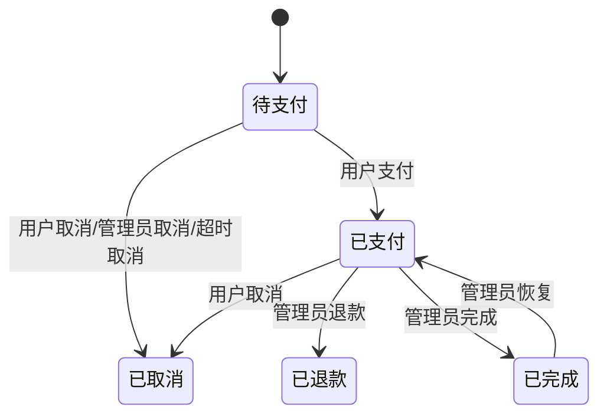

# 设计文档

## 文档说明

- 对齐基线：当前仓库实现
- 更新时间：2026-03-26
- 说明：本版重点同步推荐系统、Redis 分区、管理端调试能力与数据库现状

## 系统概览

WayTrip 采用前后端分离架构，由 4 个主要子项目组成：

- `travel-server`：Spring Boot 后端
- `travel-web`：Web 用户端
- `travel-admin`：管理端
- `travel-miniapp`：Uni-app 小程序端

后端提供统一 REST API，用户端和管理端共用同一服务，但通过不同路由前缀和 token 类型进行隔离。

## 当前技术栈

| 层级 | 技术 |
| --- | --- |
| 后端 | Java 17, Spring Boot 3.5.11, MyBatis-Plus 3.5.5 |
| 数据 | MySQL 8.0, Redis |
| Web 用户端 | Vue 3, Vite, Element Plus, Pinia, Axios |
| 管理端 | Vue 3, Vite, Element Plus, ECharts, Pinia, Axios |
| 小程序端 | Uni-app, Vue 3, Pinia |
| 文档 | Knife4j / OpenAPI 3 |

## 逻辑架构

```mermaid
graph TB
    MP[小程序端]
    WEB[Web 用户端]
    ADMIN[管理端]

    API[Spring Boot API]
    AUTH[认证与资料]
    SPOT[景点]
    GUIDE[攻略]
    REVIEW[评分评论]
    FAV[收藏]
    ORDER[订单]
    REC[推荐]
    DASH[仪表板]
    BANNER[轮播图]
    USER[用户管理]
    ADMINMGR[管理员管理]
    REGION[地区管理]
    CATEGORY[分类管理]
    UPLOAD[文件上传]

    MYSQL[(MySQL)]
    REDIS[(Redis)]

    MP --> API
    WEB --> API
    ADMIN --> API

    API --> AUTH
    API --> SPOT
    API --> GUIDE
    API --> REVIEW
    API --> FAV
    API --> ORDER
    API --> REC
    API --> DASH
    API --> BANNER
    API --> USER
    API --> ADMINMGR
    API --> REGION
    API --> CATEGORY
    API --> UPLOAD

    AUTH --> MYSQL
    SPOT --> MYSQL
    GUIDE --> MYSQL
    REVIEW --> MYSQL
    FAV --> MYSQL
    ORDER --> MYSQL
    DASH --> MYSQL
    BANNER --> MYSQL
    USER --> MYSQL
    ADMINMGR --> MYSQL
    REGION --> MYSQL
    CATEGORY --> MYSQL
    UPLOAD --> MYSQL

    REC --> MYSQL
    REC --> REDIS
```

## 路由设计

### 用户端路由前缀

- 主业务接口：`/api/v1/*`
- 资料接口主入口：`/api/v1/user/*`
- 资料兼容路径：`/api/v1/auth/*`
- 推荐接口：`/api/v1/recommendations`

设计结论：

- ` /api/v1/user/* ` 是当前收口后的资料主路径。
- ` /api/v1/auth/* ` 中与资料相关的接口仅保留兼容能力。
- 新前端调用和后续文档都应统一围绕 ` /api/v1/user/* ` 展开。

### 管理端路由前缀

- 统一前缀：`/api/admin/v1/*`
- 推荐调参入口：`/api/admin/v1/recommendation/*`
- 管理端认证、数据管理、统计、上传都走该前缀

## 认证与上下文

### Token 模型

- 用户端与管理端均使用 JWT
- 服务端通过拦截器区分用户 token 和管理员 token
- 登录成功后将身份信息写入 `UserContext`

### 访问控制

- 用户端受保护接口要求用户 token
- 管理端接口要求管理员 token
- 用户端和管理端凭证不可混用

## 核心业务设计

### 1. 用户认证与资料

包含：

- 微信登录
- 小程序绑定手机号
- Web 注册/登录
- 用户信息读取与修改
- 偏好设置
- 修改密码
- 账户注销
- 管理员登录与信息读取

当前实现特点：

- 小程序端新用户先返回 `openid`
- 绑定手机号时支持与已有 Web 账户合并
- 用户资料接口已收口为 `/api/v1/user/*` 主路径，`/api/v1/auth/*` 仅保留兼容层

### 2. 景点模块

包含：

- 用户端景点列表、搜索、详情、筛选
- 管理端景点 CRUD、发布状态维护
- 景点图片上传
- 浏览行为记录与热度累积

当前实现特点：

- 景点详情包含图片、评论、收藏状态
- 管理端支持封面图和多张详情图上传
- 用户端仅展示已发布且未删除内容
- 浏览行为进入 `user_spot_view`，并通过 Redis 去重窗口控制热度累积频率

### 3. 攻略模块

包含：

- 用户端攻略列表、详情、分类
- 管理端攻略 CRUD、发布、关联景点

当前实现特点：

- 内容以富文本 HTML 保存和渲染
- 管理端使用富文本编辑器

### 4. 评分评论与收藏

包含：

- 评分提交和更新
- 评论列表读取
- 收藏增删查

当前实现特点：

- 单用户对单景点仅保留一条评分记录
- 评分写入后回刷景点 `avg_rating` 与 `rating_count`

### 5. 订单状态机

状态：

- `0` 待支付
- `1` 已支付
- `2` 已取消
- `3` 已退款
- `4` 已完成

状态转换：

```mermaid
stateDiagram-v2
    [*] --> 待支付
    待支付 --> 已支付: 用户支付
    待支付 --> 已取消: 用户取消/管理员取消/超时取消
    已支付 --> 已取消: 用户取消
    已支付 --> 已退款: 管理员退款
    已支付 --> 已完成: 管理员完成
    已完成 --> 已支付: 管理员恢复
```

当前实现特点：

- 订单创建、支付、取消带幂等或状态校验
- 存在超时自动取消定时任务

### 6. 推荐系统

推荐策略：

1. 汇总评分、收藏、订单、浏览四类行为
2. 对浏览行为按来源与停留时长做细化加权
3. 基于 IUF 加权余弦相似度构建景点相似度矩阵
4. 过滤已评分、已收藏、已下单未取消景点
5. 评分不足时走冷启动与热门兜底
6. 在线结果再按热度进行轻量重排
7. 推荐结果与相似度矩阵写入 Redis 缓存

当前实现特点：

- 推荐配置已拆分为 `algorithm / heat / cache` 三段结构
- 管理端支持查看配置、更新配置、查看运行状态、预览用户推荐、预览相似邻居、手动重建矩阵
- `RecommendationTask` 每天凌晨 3 点自动更新相似度矩阵
- Redis 已统一通过 `RedisKeyManager` 管理推荐相关 key

### 7. 管理端能力

管理端当前包含：

- 仪表板
- 景点管理
- 攻略管理
- 轮播图管理
- 订单管理
- 用户管理
- 管理员管理
- 地区管理
- 分类管理
- 推荐配置、执行、预览与调试页面
- 文件上传

## Redis 设计摘要

当前 Redis 分为 3 组核心用途：

1. 推荐配置与状态
- `waytrip:recommendation:config:*`
- `waytrip:recommendation:status`

2. 推荐计算缓存
- `waytrip:recommendation:user:{userId}`
- `waytrip:recommendation:similarity:{spotId}`

3. 景点热度浏览去重
- `waytrip:spot:heat:view:{spotId}:{userId}`

设计原则：

- 统一由 `RedisKeyManager` 管理键名
- 配置与状态长期保留，缓存结果按 TTL 自动失效
- Redis 不再只是“矩阵存储”，而是推荐引擎运行时的一部分

## 数据设计摘要

核心表：

- `user`
- `admin`
- `spot`
- `spot_image`
- `spot_region`
- `spot_category`
- `guide`
- `guide_spot_relation`
- `user_spot_review`
- `user_spot_favorite`
- `user_spot_view`
- `order`
- `spot_banner`
- `user_preference`

通用约定：

- 核心业务表普遍使用逻辑删除字段 `is_deleted`
- 用户端读取默认过滤 `is_deleted=0`
- 用户端内容默认过滤 `is_published=1` 或 `is_enabled=1`
- `user_spot_view` 作为行为日志表，不使用逻辑删除

## 文件上传设计

当前上传接口：

- 用户头像：`POST /api/v1/upload/avatar`
- 管理端图片：`POST /api/admin/v1/upload/image`
- 管理端图标：`POST /api/admin/v1/upload/icon`

约束：

- 头像默认 2MB
- 管理端图片默认 5MB
- 管理端图标默认 2MB

## 当前技术债

### 已知文档债

- API 文档仍需继续回填推荐管理端细节与调试说明
- 验收勾选与模块完成度需要继续与代码同步

### 已知工程债

- 测试覆盖仍偏薄，当前主要覆盖认证、订单、用户管理和鉴权场景
- 推荐链路的自动化验证仍需补齐
- 性能优化未系统推进

## 后续建议

1. 补推荐链路与缓存行为的测试
2. 继续做数据库查询与首屏性能优化
3. 统一回填 API、任务、验收文档
