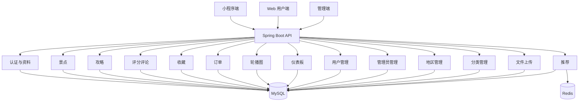
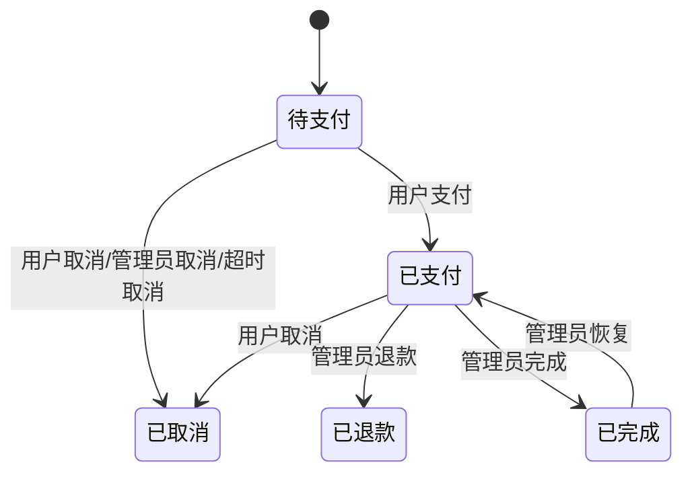

# 设计文档

## 文档说明

- 对齐基线：当前仓库实现
- 更新时间：2026-03-22
- 说明：本版重点修正架构、接口分层、任务状态与当前实现不一致的问题

## 系统概览

WayTrip 采用前后端分离架构，由 4 个主要子项目组成：

- `travel-server`：Spring Boot 后端
- `travel-web`：Web 用户端
- `travel-admin`：管理端
- `travel-miniapp`：Uni-app 小程序端

后端提供统一 REST API，用户端和管理端共用同一服务，但通过不同路由前缀和 token 类型进行隔离。

## 当前技术栈

| 层级 | 技术 |
| --- | --- |
| 后端 | Java 17, Spring Boot 3.5.11, MyBatis-Plus 3.5.5 |
| 数据 | MySQL 8.0, Redis |
| Web 用户端 | Vue 3, Vite, Element Plus, Pinia, Axios |
| 管理端 | Vue 3, Vite, Element Plus, ECharts, Pinia, Axios |
| 小程序端 | Uni-app, Vue 3, Pinia |
| 文档 | Knife4j / OpenAPI 3 |

## 逻辑架构

```mermaid
graph TB
    MP[小程序端]
    WEB[Web 用户端]
    ADMIN[管理端]

    API[Spring Boot API]
    AUTH[认证与资料]
    SPOT[景点]
    GUIDE[攻略]
    REVIEW[评分评论]
    FAV[收藏]
    ORDER[订单]
    REC[推荐]
    BANNER[轮播图]
    DASH[仪表板]
    USER[用户管理]
    ADMINMGR[管理员管理]
    REGION[地区管理]
    CATEGORY[分类管理]
    UPLOAD[文件上传]

    MYSQL[(MySQL)]
    REDIS[(Redis)]

    MP --> API
    WEB --> API
    ADMIN --> API

    API --> AUTH
    API --> SPOT
    API --> GUIDE
    API --> REVIEW
    API --> FAV
    API --> ORDER
    API --> REC
    API --> BANNER
    API --> DASH
    API --> USER
    API --> ADMINMGR
    API --> REGION
    API --> CATEGORY
    API --> UPLOAD

    AUTH --> MYSQL
    SPOT --> MYSQL
    GUIDE --> MYSQL
    REVIEW --> MYSQL
    FAV --> MYSQL
    ORDER --> MYSQL
    BANNER --> MYSQL
    DASH --> MYSQL
    USER --> MYSQL
    ADMINMGR --> MYSQL
    REGION --> MYSQL
    CATEGORY --> MYSQL
    UPLOAD --> MYSQL

    REC --> MYSQL
    REC --> REDIS
```

## 路由设计

### 用户端路由前缀

- 主业务接口：`/api/v1/*`
- 当前资料接口存在两套入口：
  - `AuthController`：`/api/v1/auth/user-info`、`/api/v1/auth/password`、`/api/v1/auth/preferences`
  - `ProfileController`：`/api/v1/user/info`、`/api/v1/user/password`、`/api/v1/user/preferences`、`/api/v1/user/account`

设计结论：

- 资料相关接口当前为“新旧并存”的兼容状态。
- 后续如果清理接口，应保留一套主入口并做版本说明。

### 管理端路由前缀

- 统一前缀：`/api/admin/v1/*`
- 管理端认证、数据管理、统计、上传都走该前缀

## 认证与上下文

### Token 模型

- 用户端与管理端均使用 JWT
- 服务端通过拦截器区分用户 token 和管理员 token
- 登录成功后将身份信息写入 `UserContext`

### 访问控制

- 用户端受保护接口要求用户 token
- 管理端接口要求管理员 token
- 用户端和管理端凭证不可混用

## 核心业务设计

### 1. 用户认证与资料

包含：

- 微信登录
- 小程序绑定手机号
- Web 注册/登录
- 用户信息读取与修改
- 偏好设置
- 修改密码
- 账户注销
- 管理员登录与信息读取

当前实现特点：

- 小程序端新用户先返回 `openid`
- 绑定手机号时支持与已有 Web 账户合并
- 用户资料接口存在双路由兼容

### 2. 景点模块

包含：

- 用户端景点列表、搜索、详情、筛选
- 管理端景点 CRUD、发布状态维护
- 景点图片上传

当前实现特点：

- 景点详情包含图片、评论、收藏状态
- 管理端支持封面图和多张详情图上传
- 用户端仅展示已发布且未删除内容

### 3. 攻略模块

包含：

- 用户端攻略列表、详情、分类
- 管理端攻略 CRUD、发布、关联景点

当前实现特点：

- 内容以富文本 HTML 保存和渲染
- 管理端使用富文本编辑器

### 4. 评分评论与收藏

包含：

- 评分提交和更新
- 评论列表读取
- 收藏增删查

当前实现特点：

- 单用户对单景点仅保留一条评分记录
- 评分写入后回刷景点 `avg_rating` 与 `rating_count`

### 5. 订单状态机

状态：

- `0` 待支付
- `1` 已支付
- `2` 已取消
- `3` 已退款
- `4` 已完成

状态转换：

```mermaid
stateDiagram-v2
    [*] --> 待支付
    待支付 --> 已支付: 用户支付
    待支付 --> 已取消: 用户取消/管理员取消/超时取消
    已支付 --> 已取消: 用户取消
    已支付 --> 已退款: 管理员退款
    已支付 --> 已完成: 管理员完成
    已完成 --> 已支付: 管理员恢复
```

当前实现特点：

- 订单创建、支付、取消带幂等或状态校验
- 存在超时自动取消定时任务

### 6. 推荐系统

推荐策略：

1. 基于用户评分构建 ItemCF 候选集
2. 过滤已评分、已收藏、已下单未取消景点
3. 评分不足时走冷启动
4. 支持主动刷新推荐结果
5. 相似度矩阵存入 Redis

相似度刷新：

- `RecommendationTask` 定时更新物品相似度矩阵

### 7. 管理端能力

管理端当前包含：

- 仪表板
- 景点管理
- 攻略管理
- 轮播图管理
- 订单管理
- 用户管理
- 管理员管理
- 地区管理
- 分类管理
- 文件上传

## 数据设计摘要

核心表：

- `user`
- `admin`
- `spot`
- `spot_image`
- `spot_region`
- `spot_category`
- `guide`
- `guide_spot_relation`
- `user_spot_review`
- `user_spot_favorite`
- `order`
- `spot_banner`
- `user_preference`

通用约定：

- 所有业务表使用逻辑删除字段 `is_deleted`
- 大部分表包含 `created_at`、`updated_at`
- 用户端读取默认过滤 `is_deleted=0`
- 用户端内容默认过滤 `is_published=1` 或 `is_enabled=1`

## 文件上传设计

当前上传接口：

- 用户头像：`POST /api/v1/upload/avatar`
- 管理端图片：`POST /api/admin/v1/upload/image`
- 管理端图标：`POST /api/admin/v1/upload/icon`

约束：

- 头像默认 2MB
- 管理端图片默认 5MB
- 管理端图标默认 2MB

## 当前技术债

### 已知文档债

- 资料接口存在双路由，历史文档长期混用
- 任务文档曾遗漏已完成的图片上传接口
- 测试与验收项未回填

### 已知工程债

- `src/test/java` 目录为空，测试尚未补齐
- 性能优化未系统推进
- 文档状态此前明显落后于实现

## 后续建议

1. 统一资料接口主路径，保留兼容说明
2. 先补集成测试和关键业务测试
3. 再做 Redis 缓存与首屏性能优化
4. 最后统一回填验收检查点
