# AI 客服架构与实现说明

本文档用于说明 WayTrip 当前 AI 客服模块的核心架构、技术选型、主链路设计与联调入口。根 README 只保留总览，本文件作为 AI 客服的正式说明文档。

## 模块定位

WayTrip 的 AI 客服不是一个独立站点，而是一套贯穿用户 Web、管理端和后端服务的协同能力：

- `travel-web` 负责用户侧 AI 聊天交互、建议问题、会话态持久化和流式消息展示
- `travel-admin` 负责 AI 知识文档维护、RAG preview、命中知识域查看和联调验证
- `travel-server` 负责 AI 主编排、Prompt 组装、意图识别、RAG 检索、Function Calling、记忆管理和业务工具调用

## 技术关键词

当前 AI 客服链路涉及的核心技术与关键词如下：

- `Spring AI`
- `RAG`
- `Prompt Engineering`
- `Function Calling`
- `SSE`
- `Redis Vector Store`
- `Redis Stream`
- `Embedding`
- `Intent Detection`
- `OpenAI Compatible API`
- `Ollama`
- `Micrometer`

这些关键词对应的实际落点不是营销名词，而是当前代码里已经使用或已经纳入运行链路的能力。

## 整体架构

  

当前主链路采用“意图驱动的双轨 RAG”结构：

1. 请求进入后，先做会话标识、来源页面、用户身份和基础风控处理
2. 基于用户问题、前端 `scenarioHint` 和来源页面做场景路由
3. 左轨执行 RAG 检索，召回平台规则、账号边界、景点知识等上下文
4. 右轨执行业务上下文预处理，包括意图识别、工具预执行和业务上下文拼装
5. 两轨结果在主编排层融合后，进入最终生成模型
6. 通过 `SSE` 按增量分片流式返回给前端

这种设计的目标不是把所有能力都塞给一个 Prompt，而是把“知识召回”“业务事实”“生成表达”拆开，降低模型幻觉和链路耦合。

## 三段模型配置

当前 AI 模型配置显式拆成三段：

- `APP_AI_GENERATION_*`
  - 负责最终答案生成
  - 当前默认接入 OpenAI 兼容接口
- `APP_AI_INTENT_*`
  - 负责意图识别与槽位提取
  - 当前默认接入本地 Ollama
- `APP_AI_EMBEDDING_*`
  - 负责知识入库和查询时的向量化
  - 当前默认接入本地 Ollama

这样拆分的原因是三类任务对模型能力和成本要求并不相同：

- 最终生成更看重回答质量和稳定性
- 意图识别更看重低成本和结构化输出
- Embedding 更看重向量空间稳定性

## Prompt

Prompt 在当前系统里不是单一长文本，而是分层拼装的：

- 系统角色与总体约束
- 场景级 Prompt
- RAG 召回片段
- 工具返回结果
- 业务规则真相源摘要

这样做的目的，是让 Prompt 承担“表达约束”和“上下文编排”的职责，而不是让 Prompt 去替代真实业务规则。

## RAG

RAG 在当前系统中的职责是补充“模型本身不知道但系统已经沉淀出来的知识”，主要包括：

- 平台规则
- 登录与个人数据边界
- 订单售后边界
- 景点/攻略内容知识

当前 RAG 设计特征：

- 检索实现基于 `Redis Vector Store`
- 支持按场景选择知识域
- 管理端 preview 支持查看多知识域命中结果
- 对未登录订单问法等边界问题做了定向召回加固

需要注意的是，RAG 负责召回知识，不负责直接给出最终答案。最终答案仍由生成模型在规则约束下输出。

## Embedding 与 Redis Vector

知识入库和查询都依赖 Embedding 模型把文本转换为向量，再写入 Redis 向量索引。

当前约定：

- 向量 Redis 默认使用独立端口 `6380`
- Embedding 模型切换后，需要重建向量库
- 向量索引与业务缓存分离，避免不同用途的数据混在同一空间

之所以单独强调这一点，是因为 Embedding 模型一旦切换，旧向量与新向量通常不在同一语义空间，继续混用会直接污染检索结果。

## Function Calling 与业务工具

当前 AI 客服并不是纯聊天模型，而是具备受控的业务工具调用能力。

典型场景包括：

- 订单查询
- 推荐解释
- 行程规划上下文补充
- 用户画像相关信息补充

这里更接近 `Function Calling` 思路：

- 模型不直接编造订单或用户事实
- 需要真实数据时，由后端工具层查询业务系统
- 最终回答必须建立在工具结果和业务规则之上

这也是当前系统避免“模型自己猜业务数据”的关键手段之一。

## SSE 流式输出

用户 Web 端聊天采用 `SSE` 返回增量内容，原因有两个：

- 用户能更早看到首字输出，体感明显好于整段等待
- 后端可以记录首字延迟、总耗时和流式窗口等性能指标

当前链路已经对以下指标做了最小埋点：

- 请求总数
- 完成结果
- 总耗时
- 首字延迟
- 并行降级次数

## Redis Stream

除了聊天链路本身，AI 知识任务还使用了 `Redis Stream` 相关机制做异步任务处理与消费监听。它主要用于：

- 知识文档入库后的索引任务派发
- 后台知识重建任务解耦
- 监听线程与实际任务线程分离

这部分能力不直接暴露给最终用户，但对管理端知识维护和 RAG 可用性是基础设施级依赖。

## Spring AI

`Spring AI` 是当前后端 AI 模块的基础框架层，主要承担：

- 模型接入抽象
- ChatClient 组装
- ChatMemory 顾问接入
- 向量库集成
- 与 OpenAI Compatible API / Ollama 的统一接入

WayTrip 当前没有把所有逻辑都塞进 Spring AI 默认流程里，而是在 Spring AI 之上保留了自己的编排层，用来处理：

- 场景路由
- 双轨并行
- 业务上下文拼装
- 风控
- 工具调用降级
- 指标记录

## 管理端联调职责

管理端当前在 AI 客服链路里承担两类职责：

- 知识运营
  - 维护 AI 知识文档
  - 重建知识索引
- 联调验证
  - preview 指定问题的召回结果
  - 查看命中知识域
  - 验证登录边界、订单边界和平台规则是否优先命中

这使 AI 客服的联调不再只能靠前台直接问模型，而是能从“检索是否合理”这一层先定位问题。

## 当前边界

当前 AI 客服已经进入可联调、可验收、可继续迭代的阶段，但还不是一个完全平台化的 AI 基础设施。当前仍保留以下边界：

- Dashboard 级别的 AI 监控尚未完整建设
- 更统一的 AI 错误码体系仍可继续下沉
- 更大规模的回归样例池仍可继续补充

因此，当前最合适的迭代方式不是继续做大重构，而是基于真实 failure case 逐条闭环。
