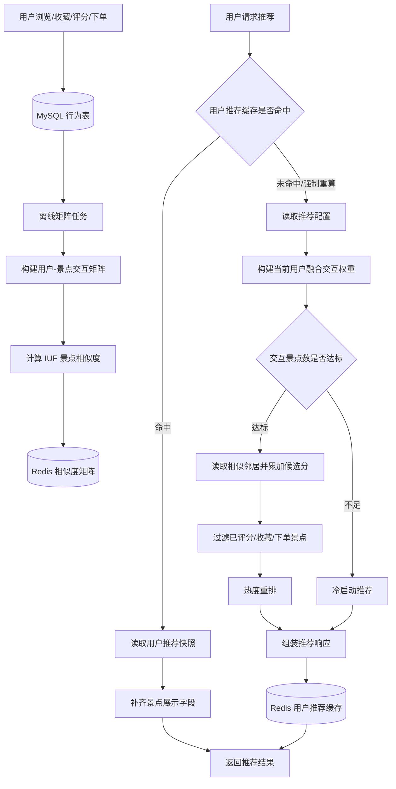
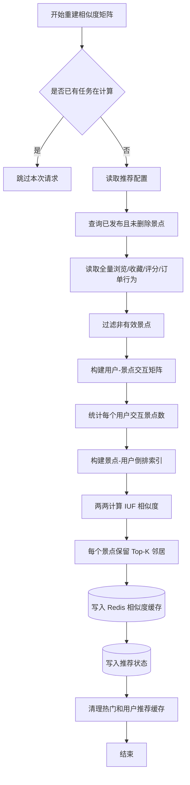
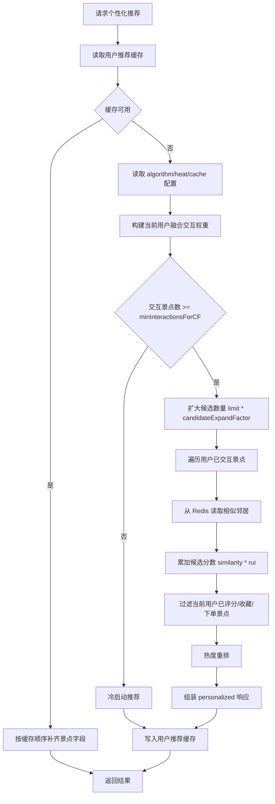
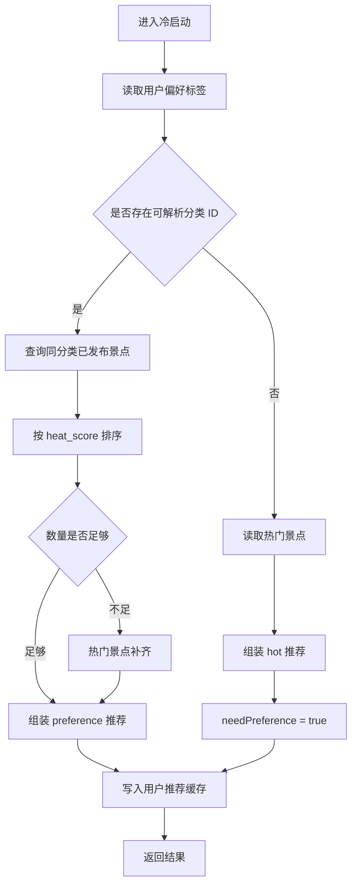

# 推荐算法模块说明

## 文档说明

- 对齐基线：当前仓库实现
- 更新时间：2026-05-29
- 代码范围：`travel-server/src/main/java/com/travel/service/impl/RecommendationServiceImpl.java` 及 `service/support/recommendation/*`
- 说明：本文用于说明 WayTrip 推荐算法模块的真实工程流程，包含数据来源、算法步骤、Redis 缓存结构、缓存失效、冷启动、热度重排和管理端调试能力。

## 模块定位

WayTrip 推荐模块采用“离线相似度矩阵 + 在线个性化打分 + Redis 缓存”的 ItemCF 工程实现。系统会把用户的浏览、收藏、评分和订单行为转换为景点兴趣信号，再结合景点之间的相似邻居生成推荐结果。

核心能力包括：

- 用户端个性化推荐
- 用户端“换一批”和强制重算
- 景点相似推荐
- 首页热门推荐
- 冷启动偏好推荐和热门兜底
- 推荐配置、状态、预览和相似邻居调试
- 相似度矩阵定时刷新
- 用户推荐结果、相似度矩阵、推荐状态和推荐配置缓存

## 相关代码

| 类 | 责任 |
| --- | --- |
| `RecommendationServiceImpl` | 推荐主流程入口，串联配置读取、协同过滤、冷启动、热度重排、缓存写入和调试信息 |
| `RecommendationScoreSupport` | 用户行为权重、候选过滤、热度重排、调试明细 |
| `RecommendationSimilaritySupport` | 相似度矩阵读取、离线构建、相似邻居预览 |
| `RecommendationColdStartSupport` | 偏好冷启动、热门补齐、偏好标签解析 |
| `RecommendationConfigSupport` | 推荐配置读取、更新和状态组装 |
| `RecommendationCacheService` | Redis 读写、配置合并、缓存清理 |
| `RedisKeyManager` | Redis Key 命名集中管理 |
| `RecommendationMatrixRefreshTask` | 每天凌晨 3 点重建物品相似度矩阵 |
| `SpotHeatServiceImpl` | 景点热度分同步，并在热度变化后清理推荐缓存 |
| `SpotBehaviorServiceImpl` | 浏览行为落库，并清理当前用户推荐缓存 |

## 整体流程



## ItemCF 算法思想

项目采用基于物品的协同过滤算法，即 ItemCF。该算法不是直接寻找相似用户，而是寻找景点之间的相似关系：如果很多用户都同时浏览、收藏、评分或购买过两个景点，则这两个景点在用户兴趣层面可能存在关联。

结合论文中 `2.3.3 ItemCF协同过滤算法` 的描述，本项目的推荐思想可以概括为三步：

1. 构建用户-景点交互矩阵：把浏览、收藏、评分、订单等行为转换成用户对景点的兴趣强度。
2. 计算景点之间的相似度：根据共同交互用户集合计算景点相似关系，并使用 IUF 降低高活跃用户对相似度的放大影响。
3. 在线生成推荐：对当前用户已交互景点的相似邻居进行打分累加，得到未交互景点的预测兴趣分，再进行过滤、热度重排和缓存。

当前工程实现更准确地说是：

```text
多行为交互输入 + IUF 共现相似度 + 在线行为权重打分 + 热度重排
```

其中，相似度矩阵主要使用“共同交互用户集合”计算；多行为权重主要在用户兴趣权重 `rui` 和在线预测分 `Puj` 中发挥作用。

## 数据来源

### 行为数据

| 表 | 字段 | 用途 |
| --- | --- | --- |
| `user_spot_view` | `user_id`, `spot_id`, `view_source`, `view_duration`, `created_at` | 浏览行为，作为轻交互信号，也用于最近浏览和热度统计 |
| `user_spot_favorite` | `user_id`, `spot_id`, `is_deleted` | 收藏行为，只统计 `is_deleted = 0` |
| `user_spot_review` | `user_id`, `spot_id`, `score`, `is_deleted` | 评分行为，只统计 `is_deleted = 0` |
| `order` | `user_id`, `spot_id`, `status`, `is_deleted` | 订单行为，推荐输入只统计已支付和已完成订单 |
| `user_preference` | `user_id`, `tag`, `is_deleted` | 冷启动偏好，`tag` 会解析为景点分类 ID |

### 景点数据

| 表 | 字段 | 用途 |
| --- | --- | --- |
| `spot` | `id` | 推荐对象主键 |
| `spot` | `is_published`, `is_deleted` | 只推荐已发布、未删除景点 |
| `spot` | `category_id`, `region_id` | 补齐推荐结果展示字段，也用于偏好冷启动 |
| `spot` | `heat_level` | 人工热度档位 |
| `spot` | `heat_score` | 热门排序和热度重排使用的最终热度分 |
| `spot` | `avg_rating`, `review_count`, `price`, `cover_image_url` | 推荐卡片展示字段 |

## 用户行为权重

在线推荐会先为当前用户构建 `Map<spotId, weight>`，表示用户对每个已交互景点的兴趣强度。

### 默认行为权重

| 行为 | 默认权重规则 |
| --- | --- |
| 浏览 | `0.5 * 来源因子 * 停留时长因子` |
| 收藏 | `1.0` |
| 评分 | `score * 0.4` |
| 已支付订单 | `3.0` |
| 已完成订单 | `4.0` |

单类行为内部按同一景点取最大值，不同行为之间再累加。例如同一个景点既浏览又收藏，则最终兴趣权重会叠加浏览权重和收藏权重。

### 浏览来源因子

| 归一化来源 | 默认因子 | 原始来源示例 |
| --- | --- | --- |
| `search` | `1.2` | `search` |
| `recommendation` | `1.1` | `recommendation`, `discover`, `random-pick`, `budget-travel`, `traveler-reviews`, `trending-views` |
| `home` | `0.9` | `home` |
| `guide` | `1.0` | `guide` |
| `detail` | `1.0` | `detail`, `list`, `nearby`, `similar`, `order`, `footprint`, `favorite`, `review` |

未知来源默认归并为 `detail`，避免来源枚举不断膨胀。

### 浏览时长因子

| 停留时长 | 默认因子 |
| --- | --- |
| `< 10 秒` | `0.6` |
| `10-59 秒` | `1.0` |
| `60-179 秒` | `1.2` |
| `>= 180 秒` | `1.35` |

## 离线相似度矩阵

### 触发入口

| 入口 | 说明 |
| --- | --- |
| `RecommendationMatrixRefreshTask` | 每天凌晨 3 点自动执行 |
| `POST /api/admin/v1/recommendation/update-matrix` | 管理端手动重建矩阵 |

### 计算流程



### 相似度公式

基础 ItemCF 会根据两个景点的共同交互用户计算相似度。本项目在此基础上引入 IUF，对高活跃用户进行降权。

```text
w(i,j) = sum(1 / log(1 + N(u))) / (sqrt(|U(i)|) * sqrt(|U(j)|))
```

含义：

- `U(i)`：交互过景点 `i` 的用户集合
- `U(j)`：交互过景点 `j` 的用户集合
- `u`：同时交互过 `i` 和 `j` 的用户
- `N(u)`：用户 `u` 交互过的景点数量

高活跃用户会同时交互大量景点，如果不降权，热门景点容易被过度关联。IUF 会降低这类用户对相似度的贡献，使长尾景点有机会被识别出来。

### 矩阵缓存

每个景点单独保存一个相似邻居缓存：

```text
key: waytrip:recommendation:similarity:{spotId}
value: Map<similarSpotId, similarity>
ttl: 默认 24 小时
```

示例：

```json
{
  "102": 0.3271,
  "118": 0.2914,
  "135": 0.2408
}
```

## 在线推荐主流程

用户端请求 `/api/v1/recommendations` 时，系统优先读取用户推荐缓存。缓存不存在时才进入实时推荐计算。



### 在线候选分数

项目使用如下思想计算候选景点分数：

```text
P(u,j) = sum(w(j,i) * r(u,i))
```

含义：

- `P(u,j)`：用户 `u` 对候选景点 `j` 的预测兴趣分
- `i`：用户已经交互过的历史景点
- `w(j,i)`：候选景点 `j` 与历史景点 `i` 的相似度
- `r(u,i)`：用户 `u` 对历史景点 `i` 的融合交互权重

如果某个候选景点同时和多个历史景点相似，则多个贡献会累加。

### 候选过滤

候选结果进入最终列表前，会过滤当前用户已经发生过关键交互的景点：

- 已评分景点
- 已收藏景点
- 已下单且订单不是已取消的景点

已取消订单不会进入过滤集合，因此用户取消订单后，该景点仍可再次被推荐。

### 热度重排

过滤后的候选会按热度做轻量重排：

```text
finalScore = itemCFScore + heatRerankFactor * (heatScore / maxHeatScore)
```

默认 `heatRerankFactor = 0.05`。该步骤只是在个性化结果上追加小幅热度加成，不会直接用热门排序替代协同过滤排序。

## 冷启动流程

当用户有效交互景点数小于 `minInteractionsForCF`，默认小于 3 个，系统进入冷启动。



冷启动类型：

| 类型 | 触发条件 | `type` | `needPreference` |
| --- | --- | --- | --- |
| 偏好冷启动 | 有有效偏好分类 | `preference` | `false` |
| 热门兜底 | 没有有效偏好，或个性化无可用结果 | `hot` | `true` |

## “换一批”和重算

| 接口 | 行为 |
| --- | --- |
| `POST /api/v1/recommendations/rotate` | 基于当前推荐缓存做有限轮换，缓存缺失时先建立推荐基线 |
| `POST /api/v1/recommendations/recompute` | 跳过旧缓存，强制重新计算并覆盖当前用户推荐缓存 |

“换一批”不会完全打乱推荐结果，只是在当前可展示范围内做有限偏移，避免把低相关候选大幅提前。

## Redis 缓存设计

```mermaid
flowchart LR
    A[推荐配置] --> A1[(waytrip:recommendation:config:algorithm)]
    A --> A2[(waytrip:recommendation:config:heat)]
    A --> A3[(waytrip:recommendation:config:cache)]

    B[离线矩阵] --> B1[(waytrip:recommendation:similarity:{spotId})]
    B --> B2[(waytrip:recommendation:status)]

    C[在线推荐] --> C1[(waytrip:recommendation:user:{userId})]
    D[首页热门] --> D1[(waytrip:home:hot:{limit})]
    E[首页轮播] --> E1[(waytrip:home:banners)]
```

### 推荐配置缓存

推荐配置拆成三段独立保存：

| Key | 内容 |
| --- | --- |
| `waytrip:recommendation:config:algorithm` | 行为权重、浏览来源因子、停留时长因子、CF 阈值、Top-K、候选扩容倍数 |
| `waytrip:recommendation:config:heat` | 热度统计增量、热度重排系数 |
| `waytrip:recommendation:config:cache` | 用户推荐 TTL、相似度矩阵 TTL |

配置读取时会先构建默认配置，再把 Redis 中已有配置合并进去，避免某一段配置缺失导致推荐链路不可用。

### 用户推荐缓存

```text
key: waytrip:recommendation:user:{userId}
ttl: 默认 60 分钟
```

缓存对象：

```json
{
  "type": "personalized",
  "needPreference": false,
  "generatedAt": 1716900000000,
  "items": [
    {
      "spotId": 101,
      "score": 1.2384
    },
    {
      "spotId": 108,
      "score": 0.9721
    }
  ]
}
```

缓存只保存推荐类型、是否需要偏好、生成时间、景点 ID 和分数。返回给前端前，系统会重新查询景点表补齐名称、封面、价格、评分、分类和地区等展示字段。

### 推荐状态缓存

```text
key: waytrip:recommendation:status
```

内容：

```json
{
  "lastUpdateTime": "2026-05-29 03:00:00",
  "totalUsers": 120,
  "totalSpots": 80
}
```

管理端状态接口会额外补充当前进程内的 `computing` 标记，用于展示是否正在重建矩阵。

## 缓存写入与失效

### 写入时机

| 缓存 | 写入时机 |
| --- | --- |
| 用户推荐缓存 | 个性化推荐计算完成、冷启动完成、重算完成、换一批后 |
| 相似度缓存 | 手动或定时重建相似度矩阵时 |
| 推荐状态缓存 | 相似度矩阵重建完成后 |
| 首页热门缓存 | 首次请求热门景点且缓存缺失时 |
| 推荐配置缓存 | 管理端保存推荐配置时 |

### 失效时机

| 触发行为 | 失效范围 |
| --- | --- |
| 浏览行为落库 | 当前用户推荐缓存 |
| 收藏/取消收藏 | 当前用户推荐缓存 |
| 评分/删除评分 | 当前用户推荐缓存，部分管理端评分操作会清全局缓存 |
| 创建、支付、取消、完成、退款、恢复订单 | 当前用户推荐缓存 |
| 用户偏好变化、资料变化、账户注销/恢复 | 当前用户推荐缓存 |
| 景点创建、编辑、发布、删除 | 首页热门缓存 + 所有用户推荐缓存 |
| 景点热度刷新 | 首页热门缓存 + 所有用户推荐缓存 |
| 推荐配置更新 | 首页热门缓存 + 所有用户推荐缓存 |
| 相似度矩阵重建完成 | 首页热门缓存 + 所有用户推荐缓存 |

说明：相似度矩阵缓存不会在用户行为变化后实时重建，它依赖定时任务或管理端手动触发。用户推荐缓存会在用户行为变化后立即失效，因此在线推荐会使用最新用户行为权重，但相似邻居仍来自最近一次离线矩阵。

## 景点热度

景点热度由人工档位和行为统计共同决定：

```text
heat_score = heat_level_base_score + behavior_heat_score
```

### 热度档位基础分

| `heat_level` | 含义 | 基础分 |
| --- | --- | --- |
| `0` | 普通 | `0` |
| `1` | 推荐 | `200` |
| `2` | 重点推荐 | `500` |
| `3` | 强推 | `1000` |

### 行为热度分

| 行为 | 默认增量 |
| --- | --- |
| 浏览 | `1` |
| 收藏 | `3` |
| 评价 | `2` |
| 已支付或已完成订单 | `5` |
| 已完成订单额外增量 | `8` |

已完成订单会同时计入“已支付或已完成订单”和“已完成订单额外增量”，因此默认总加成是 `5 + 8`。

### 热度同步入口

| 入口 | 说明 |
| --- | --- |
| `SpotHeatSyncTask` | 默认每天凌晨 3:30 全量同步 |
| `POST /api/admin/v1/spots/{spotId}/heat/refresh` | 管理端刷新单个景点热度 |
| `POST /api/admin/v1/spots/heat/refresh` | 管理端刷新全部景点热度 |

热度刷新后会清理首页热门缓存和所有用户推荐缓存，因为热门列表和热度重排都依赖 `heat_score`。

## 接口说明

### 用户端推荐接口

| 方法 | 路径 | 说明 |
| --- | --- | --- |
| `GET` | `/api/v1/recommendations` | 获取当前用户推荐，优先使用缓存 |
| `POST` | `/api/v1/recommendations/rotate` | 基于当前推荐缓存换一批 |
| `POST` | `/api/v1/recommendations/recompute` | 强制重算当前用户推荐 |
| `GET` | `/api/v1/recommendations/similar` | 获取指定景点相似邻居 |

### 管理端推荐接口

| 方法 | 路径 | 说明 |
| --- | --- | --- |
| `POST` | `/api/admin/v1/recommendation/update-matrix` | 手动重建相似度矩阵 |
| `GET` | `/api/admin/v1/recommendation/config` | 获取推荐配置 |
| `PUT` | `/api/admin/v1/recommendation/config` | 更新推荐配置 |
| `GET` | `/api/admin/v1/recommendation/status` | 获取推荐状态 |
| `GET` | `/api/admin/v1/recommendation/preview` | 预览指定用户推荐 |
| `GET` | `/api/admin/v1/recommendation/similarity-preview` | 预览指定景点相似邻居 |

## 管理端调试预览

管理端预览接口支持两种模式：

| 参数 | 含义 |
| --- | --- |
| `mode=cache` | 优先查看当前用户推荐缓存；无缓存或缓存不可读时回退为最新计算结果 |
| `mode=latest` | 按最新用户行为即时计算，不默认写入线上缓存 |
| `writeCache=true` | 将预览结果写入当前用户推荐缓存 |
| `rotate=true` | 模拟换一批 |
| `debug=true` | 返回调试明细 |

开启 `debug=true` 后，响应会包含：

- 用户行为统计
- 浏览、收藏、评分、订单明细
- 融合交互权重
- ItemCF 原始候选分
- 被过滤景点
- 过滤后分数
- 热度重排后分数
- 最终结果贡献来源
- 触发冷启动或协同过滤的原因

## 推荐结果类型

| `type` | 来源 | 说明 |
| --- | --- | --- |
| `personalized` | ItemCF 主链路 | 用户交互足够，成功生成个性化候选 |
| `preference` | 偏好冷启动 | 用户交互不足，但存在可解析偏好分类 |
| `hot` | 热门兜底 | 用户交互不足且无有效偏好，或个性化候选过滤后为空 |

## 当前实现特点

1. 相似度矩阵离线计算，在线推荐只读取 Redis 相似邻居并聚合分数。
2. 用户兴趣权重融合了浏览、收藏、评分和订单，浏览行为细分来源和停留时长。
3. 相似度采用 IUF 共现相似度，降低高活跃用户对相似度的放大影响。
4. 个性化结果会过滤用户已经评分、收藏、下单未取消的景点。
5. 热度只做轻量重排，不替代个性化排序。
6. 冷启动优先使用用户偏好分类，再用热门景点兜底。
7. 推荐配置按 `algorithm / heat / cache` 三段缓存，便于管理端调参。
8. 用户推荐结果以结构化快照保存，支持用户端快速读取和换一批。

## 注意事项

- 浏览行为会立即影响当前用户下一次在线推荐计算，但不会立即改变相似度矩阵。
- 相似度矩阵依赖定时任务或管理端手动重建，若刚导入大量行为数据，需要手动重建矩阵才能让相似邻居更新。
- 用户推荐缓存命中时不会重新计算分数，只会按缓存中的景点顺序补齐展示字段。
- 已下架或已删除景点在最终响应组装时会再次过滤，避免历史缓存脏数据透出。
- 热度同步和推荐配置更新都会清理全局推荐缓存，短时间内可能导致下一批推荐请求重新计算。
