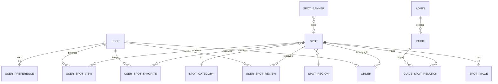

# 数据库设计文档

## 文档说明

- 对齐基线：`travel-server/src/main/resources/db/schema.sql`
- 更新时间：2026-04-08
- 说明：本版按当前建表脚本、推荐实现、用户行为链路与四端重构后的使用现状同步

## 数据库基础信息

| 项    | 值                    |
|------|----------------------|
| 数据库名 | `waytrip_db`         |
| 数据库  | MySQL 8.0            |
| 字符集  | `utf8mb4`            |
| 排序规则 | `utf8mb4_unicode_ci` |
| 存储引擎 | InnoDB               |

## 表总览

当前共有 14 张核心业务表：

1. `user`
2. `user_preference`
3. `admin`
4. `spot_region`
5. `spot_category`
6. `spot`
7. `spot_image`
8. `guide`
9. `guide_spot_relation`
10. `order`
11. `user_spot_review`
12. `user_spot_favorite`
13. `spot_banner`
14. `user_spot_view`

## 关系摘要

## 表结构摘要

### 1. `user`

用途：用户主表，兼容小程序 OpenID 与 Web 手机号密码账户。

关键字段：

- `openid`
- `phone`
- `password`
- `avatar_url`
- `is_deleted`
- `last_login_at`

约束：

- `uk_openid`
- `uk_phone`

### 2. `user_preference`

用途：用户偏好标签。

关键字段：

- `user_id`
- `tag`
- `is_deleted`

约束：

- `uk_user_tag(user_id, tag)`

### 3. `admin`

用途：后台管理员账户。

关键字段：

- `username`
- `password`
- `real_name`
- `is_enabled`
- `is_deleted`
- `last_login_at`

约束：

- `uk_username`

### 4. `spot_region`

用途：景点地区树，当前为二级结构。

关键字段：

- `parent_id`
- `name`
- `sort_order`
- `is_deleted`

### 5. `spot_category`

用途：景点分类树。

关键字段：

- `parent_id`
- `name`
- `icon_url`
- `sort_order`
- `is_deleted`

### 6. `spot`

用途：景点主表。

关键字段：

- `name`
- `description`
- `price`
- `open_time`
- `address`
- `latitude`
- `longitude`
- `cover_image_url`
- `category_id`
- `region_id`
- `heat_level`
- `heat_score`
- `avg_rating`
- `rating_count`
- `is_published`
- `is_deleted`

### 7. `spot_image`

用途：景点详情图片。

关键字段：

- `spot_id`
- `image_url`
- `sort_order`
- `is_deleted`

### 8. `guide`

用途：攻略主表。

关键字段：

- `title`
- `content`
- `cover_image_url`
- `category`
- `admin_id`
- `view_count`
- `is_published`
- `is_deleted`

### 9. `guide_spot_relation`

用途：攻略与景点关系表。

关键字段：

- `guide_id`
- `spot_id`
- `sort_order`
- `is_deleted`

约束：

- `uk_guide_spot(guide_id, spot_id)`

### 10. `order`

用途：用户订单。

关键字段：

- `order_no`
- `user_id`
- `spot_id`
- `quantity`
- `total_amount`
- `status`
- `visit_date`
- `contact_name`
- `contact_phone`
- `paid_at`
- `cancelled_at`
- `refunded_at`
- `completed_at`
- `is_deleted`

约束：

- `uk_order_no`

状态值：

| 值 | 含义  |
|---|-----|
| 0 | 待支付 |
| 1 | 已支付 |
| 2 | 已取消 |
| 3 | 已退款 |
| 4 | 已完成 |

### 11. `user_spot_review`

用途：景点评分评论。

关键字段：

- `user_id`
- `spot_id`
- `score`
- `comment`
- `is_deleted`

约束：

- `uk_user_spot(user_id, spot_id)`，保证单用户单景点唯一评分记录

### 12. `user_spot_favorite`

用途：景点收藏。

关键字段：

- `user_id`
- `spot_id`
- `is_deleted`

约束：

- `uk_user_spot(user_id, spot_id)`，防止重复收藏记录

### 13. `spot_banner`

用途：首页轮播图配置。

关键字段：

- `image_url`
- `spot_id`
- `sort_order`
- `is_enabled`
- `is_deleted`

### 14. `user_spot_view`

用途：用户景点浏览记录，用于推荐算法补足轻交互行为，并作为景点热度同步时的行为输入。

关键字段：

- `user_id`
- `spot_id`
- `view_source`
- `view_duration`
- `created_at`

索引：

- `idx_user_spot(user_id, spot_id)`
- `idx_spot_id(spot_id)`
- `idx_created_at(created_at)`

## 当前索引设计重点

| 表                     | 关键索引                                                                     | 用途                 |
|-----------------------|--------------------------------------------------------------------------|--------------------|
| `user`                | `uk_openid`, `uk_phone`                                                  | 登录与绑定查找            |
| `spot`                | `idx_category_id`, `idx_region_id`, `idx_heat_score`, `idx_is_published` | 列表筛选排序             |
| `guide`               | `idx_category`, `idx_view_count`, `idx_is_published`                     | 攻略筛选与展示            |
| `order`               | `uk_order_no`, `idx_status`, `idx_user_id_status`                        | 订单详情、订单列表          |
| `user_spot_review`    | `uk_user_spot`, `idx_spot_list`                                          | 评分去重、评论列表          |
| `user_spot_favorite`  | `uk_user_spot`, `idx_user_id_is_deleted_created_at`                      | 收藏去重、收藏列表          |
| `user_spot_view`      | `idx_user_spot`, `idx_spot_id`, `idx_created_at`                         | 浏览行为回放、推荐统计、热度同步统计 |
| `spot_banner`         | `idx_is_enabled_sort`                                                    | 首页轮播图读取            |
| `guide_spot_relation` | `uk_guide_spot`, `idx_guide_id_is_deleted_sort`                          | 关联景点读取             |

## Redis 使用现状

当前 Redis 已不只用于“推荐矩阵缓存”，而是包含 3 类核心用途：

1. 推荐配置与运行状态
- `waytrip:recommendation:config:algorithm`
- `waytrip:recommendation:config:heat`
- `waytrip:recommendation:config:cache`
- `waytrip:recommendation:status`

2. 推荐结果与相似度缓存
- `waytrip:recommendation:user:{userId}`
- `waytrip:recommendation:similarity:{spotId}`

3. 景点热度浏览去重
- `waytrip:spot:heat:view:{spotId}:{userId}`

补充说明：

- 近期浏览入口的数据主来源仍为 MySQL 行为表 `user_spot_view`
- Redis 去重键用于限制热度累计频率，不替代行为明细存储

当前 TTL 约定：

- 用户推荐缓存：默认 60 分钟
- 相似度矩阵缓存：默认 24 小时
- 推荐配置与运行状态：默认不自动过期

## 推荐算法相关数据流

当前推荐链路同时使用 MySQL 与 Redis：

- `user_spot_review`：显式评分行为
- `user_spot_favorite`：收藏行为
- `order`：已支付 / 已完成订单行为
- `user_spot_view`：浏览来源与停留时长行为
- `spot.heat_level`：管理端人工热度档位
- `spot.heat_score`：由热度档位与行为统计同步生成的最终热度分
- Redis：保存推荐配置、用户推荐缓存、相似度矩阵与运行状态

### 景点热度设计

当前景点热度不再采用“用户行为实时累加写入”的方式，而是采用“档位 + 同步”的方案：

- `spot.heat_level`：运营可配置的人工档位
  - `0=普通`
  - `1=推荐`
  - `2=重点推荐`
  - `3=强推`
- `spot.heat_score`：最终用于排序和热度重排的热度分

热度同步规则：

- `heat_score = heat_level 对应基础分 + 行为统计分`
- 行为统计分当前来自：
  - `user_spot_view`
  - `user_spot_favorite`
  - `user_spot_review`
  - `order`

同步入口：

- 管理端可手动同步单个景点热度
- 管理端可手动同步全部景点热度
- 服务端定时任务自动同步全部景点热度

## 数据设计约定

### 通用约定

1. 主键统一使用 `BIGINT UNSIGNED AUTO_INCREMENT`
2. 金额统一使用 `DECIMAL(10,2)`
3. 状态字段统一使用 `TINYINT`
4. URL 字段统一使用 `VARCHAR`
5. 长文本内容使用 `TEXT` 或 `MEDIUMTEXT`
6. 不使用数据库外键，关联一致性由应用层保证

### 逻辑删除

除 `user_spot_view` 外，核心业务表普遍带 `is_deleted`，业务读取默认应过滤已删除数据。

### 时间字段

当前建表脚本中多数表的 `updated_at` 使用 `DATETIME NOT NULL DEFAULT CURRENT_TIMESTAMP`。

说明：

- 历史文档曾将多张表写成 `ON UPDATE CURRENT_TIMESTAMP`，与实际脚本不完全一致。
- 如果后续需要严格依赖数据库自动更新时间，应先确认实体更新策略与建表脚本是否同步。

## 当前文档化结论

- 当前数据库基线已从 13 张核心表扩展为 14 张，新增的 `user_spot_view` 已进入推荐主流程。
- 推荐链路的“数据来源 + Redis 缓存 + 管理端调试”已经基本成型，数据库文档不能再只描述评分矩阵一层。
- 当前数据库文档应以 `schema.sql` 为唯一真实来源，并同步考虑 `RecommendationServiceImpl` 与四端前端的实际使用方式。
