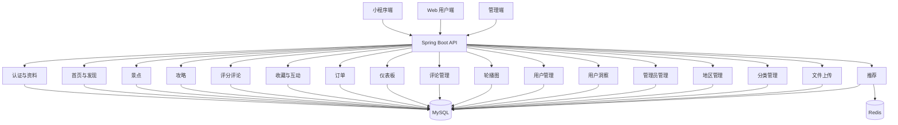
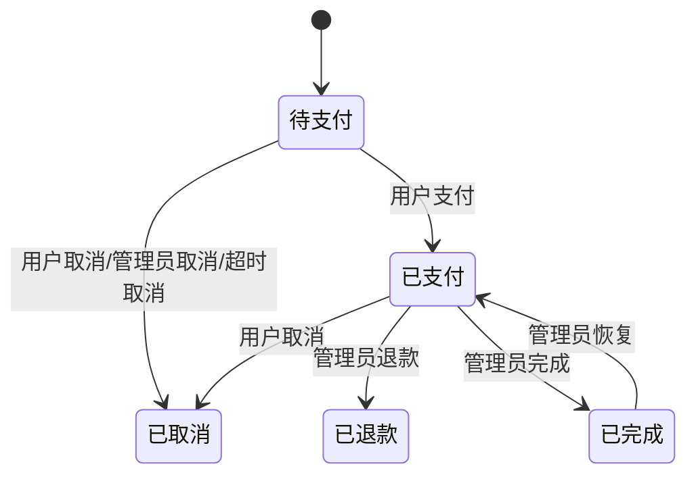

# 设计文档

## 文档说明

- 对齐基线：当前仓库实现
- 更新时间：2026-04-08
- 说明：本版同步四端重构后的系统结构，补齐 Web 用户端与小程序端对齐后的页面架构与推荐链路设计

## 系统概览

WayTrip 采用前后端分离架构，由 4 个主要子项目组成：

- `travel-server`：Spring Boot 后端
- `travel-web`：Web 用户端
- `travel-admin`：管理端
- `travel-miniapp`：Uni-app 小程序端

后端提供统一 REST API。小程序端与 Web 用户端共用用户侧接口，管理端使用独立前缀。当前系统设计重点已经从“补齐基础 CRUD”转向“推荐系统成型 + 双端体验对齐 + 管理端可观测与调试”。

## 当前技术栈

| 层级      | 技术                                            |
|---------|-----------------------------------------------|
| 后端      | Java 17、Spring Boot 3.5.11、MyBatis-Plus 3.5.5 |
| 数据      | MySQL 8.0、Redis                               |
| Web 用户端 | Vue 3、Vite、Element Plus、Pinia、Axios           |
| 管理端     | Vue 3、Vite、Element Plus、ECharts、Pinia、Axios   |
| 小程序端    | Uni-app、Vue 3、Pinia                           |
| 文档      | SpringDoc / OpenAPI 3                         |

## 逻辑架构

## 路由与接口设计

### 用户端路由前缀

- 主业务接口：`/api/v1/*`
- 资料接口主入口：`/api/v1/user/*`
- 认证兼容入口：`/api/v1/auth/*`
- 推荐接口：`/api/v1/recommendations`

设计结论：

- `/api/v1/user/*` 是当前收口后的资料主路径。
- `/api/v1/auth/*` 保留登录注册与历史兼容能力。
- 小程序端与 Web 用户端必须围绕同一用户端接口能力迭代，避免单端特供接口。

### 管理端路由前缀

- 统一前缀：`/api/admin/v1/*`
- 推荐调参入口：`/api/admin/v1/recommendation/*`
- 用户洞察入口：`/api/admin/v1/user-insights/*`

## 认证与上下文

### Token 模型

- 用户端与管理端均使用 JWT
- 服务端通过拦截器区分用户 token 和管理员 token
- 登录成功后将身份信息写入 `UserContext`

### 访问控制

- 用户端受保护接口要求用户 token
- 管理端接口要求管理员 token
- 用户端和管理端凭证不可混用

## 用户端页面架构

### 小程序端当前结构

- 首页
- 发现页
- 推荐页
- 景点列表、详情、附近页
- 攻略列表、详情
- 搜索页
- 订单列表、订单详情、创建订单
- 我的、我的互动、设置、偏好页

### Web 用户端当前结构

- 首页
- 发现页
- 推荐页
- 景点列表、详情、附近页
- 攻略列表、详情
- 搜索页
- 订单列表、订单详情、创建订单
- 个人中心、我的互动、设置页

### 双端一致性设计

当前双端不追求组件级同构，但要求遵守以下约束：

1. 核心业务能力必须一致。
2. 核心接口能力必须一致。
3. 详情返回列表后的关键状态需要尽量保持。
4. 登录方式允许保留端差异。
5. Web 可保留浏览器定位与 PC 交互差异，小程序可保留地图组件与微信能力差异。

## 核心业务设计

### 1. 用户认证与资料

包含：

- 微信登录
- 小程序绑定手机号
- Web 注册 / 登录
- 用户信息读取与修改
- 偏好设置
- 修改密码
- 账户注销
- 管理员登录与信息读取

当前实现特点：

- 小程序端新用户先返回 `openid`
- 绑定手机号时支持与已有 Web 账户合并
- 用户资料接口已收口为 `/api/v1/user/*` 主路径

### 2. 首页、发现与附近

包含：

- 首页轮播图、热门推荐、个性化推荐
- 冷启动偏好引导
- 发现页聚合浏览
- 附近景点能力

当前实现特点：

- 首页已从“单列表展示”升级为“推荐 + 附近 + 快捷入口”结构
- 小程序端与 Web 用户端均具备发现、推荐、附近主入口
- Web 端附近页使用浏览器定位，小程序端附近页使用地图能力
- 首页支持读取近期浏览内容作为回访入口

### 3. 景点模块

包含：

- 用户端景点列表、搜索、详情、筛选
- 用户行为记录与浏览足迹
- 管理端景点 CRUD、发布状态维护
- 景点评分回刷、热度同步

当前实现特点：

- 景点详情包含图片、评论、收藏状态、相似景点
- 浏览行为进入 `user_spot_view`，并通过 Redis 去重窗口控制热度累积频率
- 用户端详情页可向列表页回写收藏、评分等局部状态

### 4. 攻略模块

包含：

- 用户端攻略列表、详情、分类
- 管理端攻略 CRUD、发布、关联景点

当前实现特点：

- 内容以富文本 HTML 保存和渲染
- 列表页支持状态同步和筛选条件保留

### 5. 评分评论、收藏与互动

包含：

- 评分提交和更新
- 评论列表读取
- 收藏增删查
- 我的互动聚合页

当前实现特点：

- 单用户对单景点仅保留一条评分记录
- 评分写入后回刷景点 `avg_rating` 与 `rating_count`
- 浏览、收藏、评价在用户端逐步收口到统一互动视图

### 6. 订单状态机

状态：

- `0` 待支付
- `1` 已支付
- `2` 已取消
- `3` 已退款
- `4` 已完成

状态转换：

当前实现特点：

- 订单创建、支付、取消带幂等或状态校验
- 存在超时自动取消定时任务
- 用户端订单页支持按状态直接进入

### 7. 推荐系统

推荐策略：

1. 汇总评分、收藏、订单、浏览四类行为
2. 对浏览行为按来源与停留时长做细化加权
3. 基于 IUF 加权余弦相似度构建景点相似度矩阵
4. 过滤已评分、已收藏、已下单未取消景点
5. 评分不足时走冷启动与热门兜底
6. 在线结果再按热度进行轻量重排
7. 推荐结果与相似度矩阵写入 Redis 缓存

当前实现特点：

- 推荐配置已拆分为 `algorithm / heat / cache` 三段结构
- 管理端支持推荐总览、配置更新、状态查看、预览用户推荐、预览相似邻居、手动重建矩阵
- `RecommendationTask` 每天凌晨自动更新相似度矩阵
- `RedisKeyManager` 统一管理推荐相关 key

### 8. 管理端能力

管理端当前包含：

- 仪表板
- 评论管理
- 景点管理
- 攻略管理
- 轮播图管理
- 订单管理
- 用户管理
- 用户偏好 / 收藏 / 浏览洞察
- 管理员管理
- 地区管理
- 分类管理
- 推荐总览、推荐配置、执行、预览与调试页面
- 文件上传

## Redis 设计摘要

当前 Redis 分为 3 组核心用途：

1. 推荐配置与状态
- `waytrip:recommendation:config:*`
- `waytrip:recommendation:status`

2. 推荐计算缓存
- `waytrip:recommendation:user:{userId}`
- `waytrip:recommendation:similarity:{spotId}`

3. 景点热度浏览去重
- `waytrip:spot:heat:view:{spotId}:{userId}`

设计原则：

- 统一由 `RedisKeyManager` 管理键名
- 配置与状态长期保留，缓存结果按 TTL 自动失效
- Redis 不只是矩阵存储，而是推荐引擎运行时的一部分

## 数据设计摘要

核心表：

- `user`
- `admin`
- `spot`
- `spot_image`
- `spot_region`
- `spot_category`
- `guide`
- `guide_spot_relation`
- `user_spot_review`
- `user_spot_favorite`
- `user_spot_view`
- `order`
- `spot_banner`
- `user_preference`

通用约定：

- 核心业务表普遍使用逻辑删除字段 `is_deleted`
- 用户端读取默认过滤 `is_deleted=0`
- 用户端内容默认过滤 `is_published=1` 或 `is_enabled=1`
- `user_spot_view` 作为行为日志表，不使用逻辑删除

## 文件上传设计

当前上传接口：

- 用户头像：`POST /api/v1/upload/avatar`
- 管理端图片：`POST /api/admin/v1/upload/image`
- 管理端图标：`POST /api/admin/v1/upload/icon`

约束：

- 头像默认 2MB
- 管理端图片默认 5MB
- 管理端图标默认 2MB

## 当前技术债

### 已知工程债

- 自动化测试覆盖仍偏薄
- 推荐链路的自动化验证仍需补齐
- Web 端存在前端包体积偏大的优化空间
- 性能优化与缓存扩展尚未系统推进

### 已知文档债

- 部署说明与最终验收记录仍需继续沉淀
- 若后续继续改接口或推荐逻辑，需要同步更新 API 文档与任务状态

## 后续建议

1. 补推荐、认证、订单三个高风险链路的自动化测试
2. 做数据库查询、缓存与前端首屏性能优化
3. 继续把部署、验收与联调记录沉淀成正式文档
